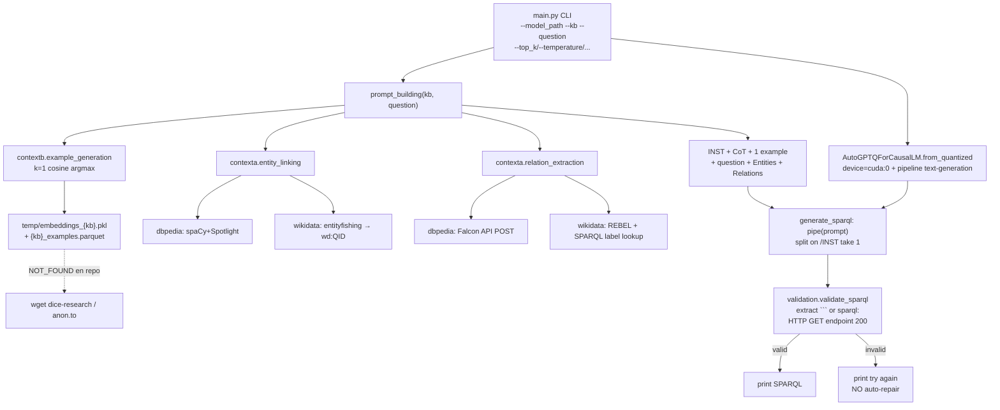

# Arquitectura y flujo de datos — CoT-SPARQL

**Fecha:** 2026-07-20  
**Pin:** `063edd9868425e54010a0cb49ce585ed2186be4d`  
**Etiquetas:** `CODE_VERIFIED` | `README_REPORTED` | `EXTERNAL_ARTIFACT_REFERENCED` | `NOT_FOUND`

---

## Resumen

Pipeline **prompt-based / zero-fine-tune del método**: recupera **un** ejemplo train por similitud coseno (MiniLM), enlaza entidades/relaciones con servicios externos, construye prompt CoT (`Let's think step by step`), genera SPARQL con LLM GPTQ (p.ej. CodeLlama-34B-Instruct-GPTQ) y “valida” ejecutando HTTP GET contra endpoints públicos (`CODE_VERIFIED`).

**No** es end-to-end offline: exige embeddings/parquet externos, LLM grande, spaCy models y APIs EL/RL (`CODE_VERIFIED` + `EXTERNAL_ARTIFACT_REFERENCED`).

---

## Diagrama Mermaid

---

## Tabla de componentes

| Componente | Path / líneas | Entrada | Salida | Evidencia |
|---|---|---|---|---|
| CLI / args | `main.py` L15–26 | argv | `args` | `CODE_VERIFIED` |
| Prompt CoT | `main.py` L29–47 | kb, question | prompt string | `CODE_VERIFIED` |
| Generación | `main.py` L55–61, L65–100 | prompt, pipe | texto post-`[/INST]` | `CODE_VERIFIED` |
| Carga GPTQ | `main.py` L66–76 | `model_path` | model CUDA | `CODE_VERIFIED` |
| Pipeline HF | `main.py` L79–92 | model+tokenizer | `text-generation` | `CODE_VERIFIED` |
| Retrieval 1-shot | `contextb.py` L16–48 | kb, question | example string | `CODE_VERIFIED` |
| Encoder | `contextb.py` L9 | — | MiniLM @ import | `CODE_VERIFIED` |
| Entity linking | `contexta.py` L10–25 | kb, question | lista entidades | `CODE_VERIFIED` |
| Relation extract | `contexta.py` L27–42 | kb, question | relaciones / dict | `CODE_VERIFIED` |
| Falcon | `contexta.py` L79–98 | text | JSON o `None` | `CODE_VERIFIED` |
| REBEL component | `spacy_component.py` | doc | `doc._.rel` | `CODE_VERIFIED` |
| Validación | `validation.py` | response, kb | `(is_valid, output)` | `CODE_VERIFIED` |

---

## Flujo textual (orden runtime)

1. Asserts CLI (`model_path`, `kb`; **assert question roto** — ver anomalías).  
2. Carga tokenizer + `AutoGPTQForCausalLM.from_quantized(..., model_basename="model", trust_remote_code=True, device="cuda:0", use_safetensors=True)`.  
3. Construye `pipeline(..., device_map="auto", do_sample=True, top_k, temperature=0.1, max_length=700, repetition_penalty=1.1, num_return_sequences=1)`.  
4. `prompt_building`: instrucción CoT + `cb.example_generation` (carga pkl/parquet) + `ca.entity_linking` + `ca.relation_extraction`.  
5. `generate_sparql` → `pipe(prompt)[0]['generated_text'].split('[/INST]')[1]`.  
6. `val.validate_sparql` → print o “try again”.

---

## Ontología / KG

**No** se carga OWL/ontología dominio-rango. El KG aparece solo vía linkers (Spotlight, Entity-Fishing, Falcon, REBEL+Wikidata) y endpoints de validación (`CODE_VERIFIED`).
