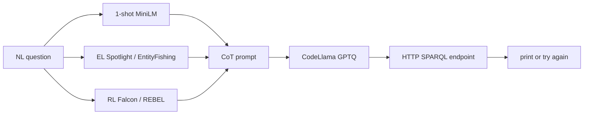

# STATIC_AUDIT — cot_sparql (WAVE_C)

**Fecha auditoría:** 2026-07-20  
**Upstream:** `upstream/cot_sparql/`  
**Pinned commit:** `063edd9868425e54010a0cb49ce585ed2186be4d` (`PIN`)  
**Lab HEAD inicio:** `562b5f1108e3289ae5b93668f2bd9d994d0a5b28` (`PIN`)  
**Paper:** SEMANTiCS 2024 / IOS SSW, DOI [10.3233/SSW240028](https://doi.org/10.3233/SSW240028) (`PIN` / `PAPER_REPORTED`)  
**Etiquetas de evidencia:** `PIN` | `CODE_VERIFIED` | `DATA_VERIFIED` | `README_REPORTED` | `PAPER_REPORTED` | `EXTERNAL_ARTIFACT_REFERENCED` | `INFERENCE` | `NOT_FOUND` | `UNKNOWN`

**Restricción de esta pasada:** solo escritura de artefactos de auditoría; **sin** install, download, ni import de `torch` / `transformers` / `spacy` / módulos del proyecto; **sin** modificar `upstream/`.

**Documentos satélite:**  
`REPOSITORY_INVENTORY.md` · `EXTERNAL_ARTIFACT_INVENTORY.csv` · `STATIC_CODE_HEALTH.md` · `ARCHITECTURE_AND_DATA_FLOW.md` · `RETRIEVAL_AND_PROMPT_AUDIT.md` · `GROUNDING_AND_LINKING_AUDIT.md` · `GROUNDING_COMPONENT_MATRIX.csv` · `DATASET_INVENTORY.csv` · `DATASET_PROVENANCE_AND_SPLITS.md` · `MODEL_AND_RUNTIME_AUDIT.md` · `DEPENDENCY_MATRIX.csv` · `VALIDATION_AND_EXECUTION_AUDIT.md` · `EVALUATION_AND_METRICS_AUDIT.md` · `PAPER_CODE_EXPERIMENT_MAPPING.csv` · `CODE_ANOMALIES_AND_RISKS.md` · `EXECUTION_READINESS.md` · `../WAVE_C_STATIC_AUDIT_MATRIX.csv`

---

## 1. Identificación y commit

| Campo | Valor | Evidencia |
|---|---|---|
| method_id | `cot_sparql` | lab |
| upstream | `upstream/cot_sparql/` | `CODE_VERIFIED` |
| pinned_commit | `063edd9868425e54010a0cb49ce585ed2186be4d` | `PIN` / lock |
| remoto | https://github.com/dice-group/CoT-Sparql | lock |
| archivos (excl. `.git_local`) | 22 | `REPO` / cloning |
| tamaño | ~64 M árbol; ~50.4 MiB contenido checksums | `REPO` / `DATA_VERIFIED` |

---

## 2. Relación paper↔repositorio

| Afirmación | Etiqueta | Notas |
|---|---|---|
| Repo oficial autores (DICE) | `PAPER_REPORTED` / lab | footnote paper |
| Venue SEMANTiCS 2024 / IOS SSW | `PIN` | DOI 10.3233/SSW240028 |
| Método CoT + 1-shot + EL/RL + LLM local | `CODE_VERIFIED` + `PAPER_REPORTED` | `main.py` / paper |
| Tablas métricas cerradas en código | `NOT_FOUND` | solo `PAPER_REPORTED` |

---

## 3. Estado legal

| Campo | Valor | Evidencia |
|---|---|---|
| license_status | `LICENSE_NOT_CONFIRMED` | `licenses/cot_sparql/` |
| SPDX | `UNKNOWN` | sin LICENSE file; GitHub `license=null` |
| Gate adapters | **no** (`common_adapter_allowed: false`) | protocolo lab |
| inclusion | `INCLUDE_CONDITIONAL` | lab |

---

## 4. Arquitectura

Pipeline **prompting** (sin fine-tune del método): retrieval one-shot MiniLM → prompt CoT con ejemplo gold + entidades/relaciones runtime → generación GPTQ (`AutoGPTQForCausalLM`) → validación HTTP a endpoints KG (`CODE_VERIFIED`). Detalle: `ARCHITECTURE_AND_DATA_FLOW.md`.

---

## 5. Diagrama Mermaid



Diagrama completo: `ARCHITECTURE_AND_DATA_FLOW.md`.

---

## 6. Entry points

| Entrypoint | Rol | Evidencia |
|---|---|---|
| `python main.py --model_path … --kb … --question …` | inferencia única | `CODE_VERIFIED` / `README_REPORTED` |
| `temp/embeddings.ipynb` | construir embeddings/parquet | `CODE_VERIFIED` |
| Scripts eval dedicados | **ausentes** | `NOT_FOUND` |

CLI defaults (`main.py` L15–24): `--top_k 10` (sampling), `--temperature 0.1`, `--max_length 700`, `--repetition_penalty 1.1`, `--num_return_sequences 1`.

---

## 7. Componentes y responsabilidades

| Componente | Path | Rol | Evidencia |
|---|---|---|---|
| Orquestación | `main.py` | CLI, GPTQ, prompt, generate, validate | `CODE_VERIFIED` |
| Linking | `contexta.py` | EL + RL | `CODE_VERIFIED` |
| Retrieval | `contextb.py` | 1-NN embeddings | `CODE_VERIFIED` |
| Validación | `validation.py` | extract + HTTP | `CODE_VERIFIED` |
| REBEL spaCy | `spacy_component.py` | pipe `rebel` | `CODE_VERIFIED` |
| Env | `environment.yml` / `requirements.txt` | deps | `CODE_VERIFIED` |

---

## 8. Entrada y salida observables

| | Valor | Evidencia |
|---|---|---|
| Entrada | `model_path`, `kb`∈{dbpedia,wikidata}, `question` | `CODE_VERIFIED` |
| Salida | string SPARQL (si “válido”) o mensaje retry | `CODE_VERIFIED` |
| Side effects | descarga HF/spaCy; llamadas Falcon/Spotlight/Entity-Fishing/endpoints; carga pkl/parquet | `CODE_VERIFIED` / `EXTERNAL_ARTIFACT_REFERENCED` |

---

## 9. Dependencias y runtimes

Conda env `sparqlgen`, Python **3.10**; pip pins: `torch==2.1.1`, `transformers==4.32.1`, `auto-gptq==0.4.2`, `sentence-transformers`, `spacy` + Spotlight/fishing, etc. (`CODE_VERIFIED` `environment.yml` ~178 líneas).  
`requirements.txt` es **export Conda** — **no** pip-installable pese a README “Without Conda” (`CODE_VERIFIED` vs `README_REPORTED`).  
Host: RTX 4050 **6 GiB** (`MACHINE_PROFILE`). Detalle: `DEPENDENCY_MATRIX.csv`, `MODEL_AND_RUNTIME_AUDIT.md`.

---

## 10. Variables de entorno y secretos

No se identificó `.env` ni API keys en código para Falcon/Spotlight (`CODE_VERIFIED` estático). Servicios públicos sin auth en URLs hardcodeadas. HF token puede aplicar en entornos restringidos (`UNKNOWN` política host). Sin secretos leídos en esta auditoría.

---

## 11. Servicios externos

| Servicio | Uso | Evidencia |
|---|---|---|
| Hugging Face Hub | GPTQ, MiniLM, REBEL | `EXTERNAL_ARTIFACT_REFERENCED` |
| Falcon API | RL DBpedia | `CODE_VERIFIED` |
| DBpedia Spotlight | EL DBpedia | `CODE_VERIFIED` |
| Entity-Fishing | EL Wikidata | `CODE_VERIFIED` |
| query.wikidata.org / dbpedia.org/sparql | RL lookup + validación | `CODE_VERIFIED` |
| files.dice-research (vía anon.to) | embeddings/parquet | `README_REPORTED` |

---

## 12. Datasets y splits

| Dataset | Train | Val/Test en repo | Evidencia |
|---|---|---|---|
| QALD-10 | 412 | **NOT_FOUND** | `DATA_VERIFIED` |
| LC-QuAD2 | 21497 | **NOT_FOUND** | `DATA_VERIFIED` |
| QALD-9 style | 350 | **NOT_FOUND** | `DATA_VERIFIED` |
| VQuAnDa | 3500 | **NOT_FOUND** | `DATA_VERIFIED` |

SHA-256 en `DATASET_INVENTORY.csv`. Parquets/pkls retrieval: **NOT_FOUND** (externos).

---

## 13. Modelos y checkpoints

| Artefacto | Estado | Evidencia |
|---|---|---|
| CodeLlama-34B-Instruct-GPTQ | externo HF; no local | `README_REPORTED` / `NOT_FOUND` local |
| Checkpoint fine-tune método | N/A / ausente | prompting |
| MiniLM / spaCy lg / REBEL | no vendored | `EXTERNAL_ARTIFACT_REFERENCED` |

→ `model_smoke` **blocked** en 6 GiB para 34B GPTQ.

---

## 14. Prompts

Prompt **en código** (`prompt_building`): instrucción CoT (“Let's think step by step”), un ejemplo recuperado, question + Entities + Relations (`CODE_VERIFIED`). Sin archivos de plantilla separados. Ver `RETRIEVAL_AND_PROMPT_AUDIT.md`.

---

## 15. Evaluación y métricas originales

BLEU, F1, F1-QALD, valid-query: **`PAPER_REPORTED` only**. Harness / predicciones: **`NOT_FOUND`**. Proxy local: HTTP 200 en `validation.py` (no métrica agregada). Ver `EVALUATION_AND_METRICS_AUDIT.md`, `PAPER_CODE_EXPERIMENT_MAPPING.csv`.

---

## 16. Comando documentado por autores

```bash
conda env create -f environment.yml && conda activate sparqlgen
# o (README): pip install -r requirements.txt  # NO fiable — export Conda
wget … dbpedia_examples.parquet embeddings_*.pkl wikidata_examples.parquet  # a temp/
python main.py --model_path TheBloke/CodeLlama-34B-Instruct-GPTQ --kb dbpedia --question '…'
```

(`README_REPORTED` — **no ejecutado** aquí.)

---

## 17. Comando todavía no verificado

Cualquier `conda`/`pip install`, import torch/transformers/spacy, wget embeddings, carga GPTQ, llamadas Falcon/Spotlight, o generación — **no verificado** (restricción WAVE_C static).

---

## 18. Compatibilidad estimada con la máquina

| Aspecto | Clase | Nota |
|---|---|---|
| DATA_ONLY inventory | **ready** | hecho |
| DEPENDENCY_INSTALL | legally_blocked/conditional | LICENSE + formato requirements |
| RETRIEVAL_SMOKE | **blocked** | sin pkl/parquet |
| LINKER_SMOKE | conditional | APIs + spaCy |
| model_smoke / end_to_end / native | **blocked / not_ready** | VRAM 6 GiB vs 34B GPTQ |
| COMMON_EVALUATION_ADAPTATION | legally_blocked | LICENSE_NOT_CONFIRMED |

---

## 19. Riesgos de ejecución

- OOM / imposible cargar 34B GPTQ en 6 GiB.  
- Assert pregunta vacía roto (L106).  
- Falcon `None` → crash; RL Wikidata `propertyLabel` mismatch.  
- Validación HTTP falsa + `'no sparql'` marcado válido.  
- Side-effect MiniLM al importar `contextb`.  
- Sin timeouts en red.  
- Licencia no confirmada.

Detalle: `CODE_ANOMALIES_AND_RISKS.md`.

---

## 20. Diferencias README↔código↔paper

| Tema | README / paper | Código / datos |
|---|---|---|
| Install sin Conda | `pip install -r requirements.txt` | archivo es Conda export |
| Embeddings | “provided” vía wget | **ausentes** en git |
| Eval métricas | tablas paper | **sin** scripts |
| `--top_k` | nombre sugiere retrieval | solo sampling LLM |
| Test sets | usados en paper | **no** en repo |
| Repair / multi-cand | CoT calidad | un sample; no repair |

---

## 21. Artefactos ausentes

LICENSE; `temp/*.pkl` / `*.parquet`; pesos LLM; predicciones; scripts eval; splits test/val — todos `NOT_FOUND` o externos. Inventario: `EXTERNAL_ARTIFACT_INVENTORY.csv`.

---

## 22. Variantes / modos KB

| Modo | EL | RL | Retrieval files | Evidencia |
|---|---|---|---|---|
| `--kb dbpedia` | Spotlight | Falcon | `embeddings_dbpedia.pkl` + `dbpedia_examples.parquet` | `CODE_VERIFIED` |
| `--kb wikidata` (else) | Entity-Fishing | REBEL + SPARQL | `embeddings_wikidata.pkl` + `wikidata_examples.parquet` | `CODE_VERIFIED` |

No hay flags de ablación CoT/EL/RL en CLI (`CODE_VERIFIED`).

---

## 23. Ruta mínima para smoke futuro

**A) DATA_ONLY (hecho):** checksums/conteos — **no** es reproducción.  

**B) RETRIEVAL_SMOKE (condicional legal):** tras aclarar licencia + descargar parquet/pkl; **sin** LLM 34B.  

**C) LINKER_SMOKE:** env spaCy + APIs; etiquetar `smoke_only`.  

**D) model/end_to_end:** requiere GPU externa o modelo menor **no-native**.  

Ninguno ejecutado en esta pasada.

---

## 24. Ruta necesaria para reproducción nativa

1. Aclarar licencia SPDX o waiver lab.  
2. Env Conda fiel a `environment.yml`.  
3. Descargar embeddings oficiales + (ideal) splits test paper.  
4. GPU con VRAM suficiente para CodeLlama-34B-Instruct-GPTQ (o documentar degradación).  
5. Servicios EL/RL + endpoints KG estables.  
6. Reimplementar o recuperar harness BLEU/F1/F1-QALD (ausente).  
7. **Estado actual:** `native_reproduction = not_ready`.

---

## 25. Adaptabilidad futura al caso de estudio (KG modelos de IA)

| Pregunta | Respuesta | Evidencia |
|---|---|---|
| ¿Consulta ontología en inferencia? | No | `CODE_VERIFIED` |
| ¿EL/RL portables a KG nuevo? | Requiere reconfigurar Spotlight/Falcon/Entity-Fishing/REBEL + endpoints | `INFERENCE` |
| ¿Retrieval? | Reconstruir parquet/pkl con ejemplos del KG objetivo | `CODE_VERIFIED` diseño |
| ¿Cambio de KG sin re-trabajo? | No viable end-to-end offline | `INFERENCE` |
| Adapters comunes | **prohibidos** ahora (`common_adapter_allowed: false`) | lab |

---

## 26. Conclusión conservadora

Auditoría estática WAVE_C de **CoT-SPARQL**: **completa** a nivel comprensión estática (código, datos train, deps, artefactos externos, anomalías, readiness).

- `reproduction_status` permanece **`audit_only`**.  
- `DATA_ONLY`: **ready**.  
- `RETRIEVAL_SMOKE` / `model_smoke` / `end_to_end` / `native`: **blocked** o **not_ready**.  
- Métricas paper: solo **`PAPER_REPORTED`**.  
- Licencia: **`LICENSE_NOT_CONFIRMED` / `UNKNOWN`**.  

**Siguiente paso lab recomendado:** `Prompt_7B_FIRESPARQL_static_audit` (fila `firesparql` en matriz WAVE_C = `pending_prompt_7B`).
