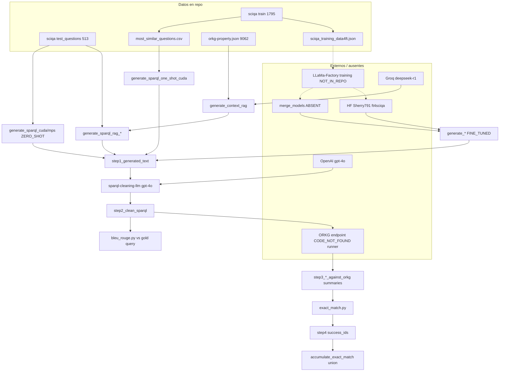

# ARCHITECTURE_AND_DATA_FLOW — firesparql

**Fecha:** 2026-07-20  
**pinned_commit:** `48d6f168e4c1dd3dc467553aef370299911d4e76` (`PIN`)

---

## Resumen arquitectónico

FIRESPARQL es un **pipeline multi-etapa** SciQA/ORKG: (opcional) preparación one-shot o RAG → generación causal LLaMA (vanilla / one-shot / FT / RAG) → **limpieza LLM (gpt-4o)** → ejecución SPARQL (**runner ausente en repo**) → métricas BLEU/ROUGE + exact match de **conjuntos de resultados** + acumulación multi-round (“RelaxedEM”).

El **fine-tuning LoRA** ocurre **fuera** de este repositorio (evidencia LLaMa-Factory); aquí solo hay datos instruction-format + scripts de inferencia sobre `merge_models/` o HF.

---

## Diagrama Mermaid

---

## Flujo por familia experimental

| Familia | Entrada modelo | Prompt | Contexto extra |
|---|---|---|---|
| `vanilla` | base Instruct | ORKG zero-shot hardcoded | no |
| `one_shot` | base Instruct | ejemplo gold `train_query` | `most_similar_questions.csv` |
| `ft` | merged LoRA / HF ft | mismo zero-shot ORKG | no |
| `vanilla_rag` / `ft_rag` | base o ft | prompt2 + contexto RAG | `context_from_rag/` |

---

## Observables I/O

- **Entrada NL:** CSV `id,question,query` (test).  
- **Salida step1:** `{id}.txt` con Question + Generated SPARQL.  
- **Salida step2:** SPARQL “cleaned”.  
- **Salida step3:** `sparql_summary.csv` (siempre casi); `sparql_results.csv` **parcial** (23 configs).  
- **Salida step4:** listas de IDs con EM=1.  

Detalle matrices: `PIPELINE_COMPONENT_MATRIX.csv`, `MODEL_CONFIGURATION_MATRIX.csv`.
