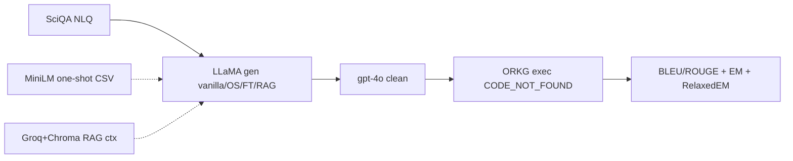

# STATIC_AUDIT — firesparql (WAVE_C)

**Fecha auditoría:** 2026-07-20  
**Upstream:** `upstream/firesparql/`  
**Pinned commit:** `48d6f168e4c1dd3dc467553aef370299911d4e76` (`PIN`)  
**Paper:** IC3K 2025 KDIR (SCITEPRESS), DOI [10.5220/0013774000004000](https://doi.org/10.5220/0013774000004000) (`PIN` / `PAPER_REPORTED`)  
**Etiquetas de evidencia:** `PIN` | `CODE_VERIFIED` | `DATA_VERIFIED` | `RESULT_FILE_VERIFIED` | `README_REPORTED` | `PAPER_REPORTED` | `EXTERNAL_ARTIFACT_REFERENCED` | `INFERENCE` | `NOT_FOUND` | `UNKNOWN` | `CODE_NOT_FOUND`

**Restricción de esta pasada:** solo escritura de artefactos de auditoría; **sin** install, download, APIs, ni import de `torch` / `pandas` / `chromadb` / módulos del proyecto; **sin** modificar `upstream/`.

**Documentos satélite:**  
`REPOSITORY_INVENTORY.md` · `CHECKPOINT_AND_TRAINING_ARTIFACT_INVENTORY.md` · `EXTERNAL_ARTIFACT_INVENTORY.csv` · `STATIC_CODE_HEALTH.md` · `ARCHITECTURE_AND_DATA_FLOW.md` · `PIPELINE_COMPONENT_MATRIX.csv` · `FINE_TUNING_REPRODUCIBILITY_AUDIT.md` · `MODEL_CONFIGURATION_MATRIX.csv` · `GENERATION_AUDIT.md` · `ONE_SHOT_RETRIEVAL_AUDIT.md` · `RAG_AUDIT.md` · `CLEANING_AND_REPAIR_AUDIT.md` · `EXECUTION_AND_QLEVER_AUDIT.md` · `DATASET_INVENTORY.csv` · `DATASET_PROVENANCE_AND_SPLITS.md` · `RESULTS_INVENTORY.csv` · `RESULT_PROVENANCE_AND_COMPLETENESS.md` · `METRICS_AUDIT.md` · `PAPER_RESULTS_CODE_MAPPING.csv` · `EXPERIMENT_CONFIGURATION_MATRIX.csv` · `DEPENDENCY_AND_RUNTIME_AUDIT.md` · `DEPENDENCY_MATRIX.csv` · `GENERALITY_AND_KG_USAGE_AUDIT.md` · `CODE_ANOMALIES_AND_RISKS.md` · `EXECUTION_READINESS.md` · `../WAVE_C_STATIC_AUDIT_MATRIX.csv`

---

## 1. Identificación y commit

| Campo | Valor | Evidencia |
|---|---|---|
| method_id | `firesparql` | lab |
| upstream | `upstream/firesparql/` | `CODE_VERIFIED` |
| pinned_commit | `48d6f168e4c1dd3dc467553aef370299911d4e76` | `PIN` / `METHOD_REGISTRY` |
| remoto | https://github.com/sherry-pan/FIRESPARQL | lock / remote |
| archivos (excl. `.git_local`) | ~71954 (~71904 bajo `results/`) | `REPO` |
| tamaño | ~598 M (`codes/` ~3 M; `experiment_datasets/` ~96 M; `results/` ~458 M) | `REPO` |

---

## 2. Relación paper↔repositorio

| Afirmación | Etiqueta | Notas |
|---|---|---|
| Repo oficial autores | `PAPER_REPORTED` / lab | GitHub `sherry-pan/FIRESPARQL` |
| Venue IC3K 2025 KDIR + DOI | `PIN` / `PAPER_REPORTED` | 10.5220/0013774000004000 |
| README aún “Under Review” | `README_REPORTED` | **desfase** vs registry publicado |
| FT LoRA LLaMA-3-8B 15ep SOTA SciQA/ORKG | `PAPER_REPORTED` / `README_REPORTED` | trainer **no** en repo |
| Tabla métricas en README | `PAPER_REPORTED` / `README_REPORTED` | no recompute aquí |
| HF best checkpoint | `EXTERNAL_ARTIFACT_REFERENCED` | MIT card ≠ LICENSE git |

---

## 3. Estado legal

| Campo | Valor | Evidencia |
|---|---|---|
| license_status | `LICENSE_NOT_CONFIRMED` | `licenses/firesparql/`; LICENSE **ABSENT** |
| SPDX código GitHub | `UNKNOWN` | `NOT_FOUND` |
| HF `Sherry791/...ft4sciqa` | MIT (model card) | **no transferir** al código |
| Gate adapters | **no** (`common_adapter_allowed: false`) | protocolo lab |
| inclusion | `INCLUDE_CONDITIONAL` | lab |

---

## 4. Arquitectura

Pipeline **multi-etapa** SciQA/ORKG: zero/one-shot/FT/RAG generation (LLaMA Instruct ± merged LoRA) → cleaning **gpt-4o** → ejecución SPARQL (**runner `CODE_NOT_FOUND`**) → BLEU/ROUGE léxico + EM de result sets + unión multi-round. Fine-tuning LoRA **externo** (LLaMa-Factory). Detalle: `ARCHITECTURE_AND_DATA_FLOW.md`.

---

## 5. Diagrama Mermaid

Diagrama completo: `ARCHITECTURE_AND_DATA_FLOW.md`.

---

## 6. Entry points

| Entrypoint | Rol | Evidencia |
|---|---|---|
| `generate_sparql_cuda.py` / `_mps.py` | zero-shot / FT infer | `CODE_VERIFIED` |
| `generate_sparql_one_shot_cuda.py` | one-shot gen | `CODE_VERIFIED` |
| `generate_context_rag.py` | contextos RAG | `CODE_VERIFIED` |
| `generate_sparql_rag_*.py` | gen con contexto | `CODE_VERIFIED` |
| `sparql-cleaning-llm.py` | cleaning gpt-4o | `CODE_VERIFIED` |
| `bleu_rouge.py` / `exact_match.py` / `accumulate_exact_match.py` | métricas | `CODE_VERIFIED` |
| `run_all_*.sh` | batch Snellius | `CODE_VERIFIED` |
| QLever/ORKG runner | **ausente** | `CODE_NOT_FOUND` |
| Trainer LoRA | **ausente** | `NOT_FOUND` |

---

## 7. Componentes y responsabilidades

Ver `PIPELINE_COMPONENT_MATRIX.csv` (etapas A–H + FT prep/train). Familias results: `vanilla`, `one_shot`, `ft`, `vanilla_rag`, `ft_rag` (`RESULT_FILE_VERIFIED`).

---

## 8. Entrada y salida observables

| | Valor | Evidencia |
|---|---|---|
| Entrada | CSV test 513; opcional most_similar / context RAG; `model_path` | `CODE_VERIFIED` / `DATA_VERIFIED` |
| Salida step1–2 | `{id}.txt` SPARQL crudo/limpio | `RESULT_FILE_VERIFIED` |
| Salida step3 | summaries (65) + results parciales (23) | `RESULT_FILE_VERIFIED` |
| Side effects | HF downloads; Groq; OpenAI; endpoint KG | `CODE_VERIFIED` / `EXTERNAL_ARTIFACT_REFERENCED` |

---

## 9. Dependencias y runtimes

Sin `requirements.txt` / `environment.yml` / Dockerfile (`NOT_FOUND`; README *Coming soon*). Imports: torch, transformers, pandas, sentence-transformers, chromadb, llama-index, openai, nltk, rouge, dotenv (`CODE_VERIFIED`). Detalle: `DEPENDENCY_AND_RUNTIME_AUDIT.md`, `DEPENDENCY_MATRIX.csv`.

---

## 10. Variables de entorno y secretos

`OPENAI_API_KEY` (cleaning), `GROQ_API_KEY` (RAG). Sin `.env` vendored. **No** se leyeron secretos en esta auditoría.

---

## 11. Servicios externos

| Servicio | Uso | Evidencia |
|---|---|---|
| Hugging Face | bases + FT checkpoint + MiniLM/BGE | `EXTERNAL_ARTIFACT_REFERENCED` |
| Groq | deepseek-r1-distill-llama-70b | `CODE_VERIFIED` |
| OpenAI | gpt-4o cleaning | `CODE_VERIFIED` |
| ORKG SPARQL | ejecución (artefactos) | `RESULT_FILE_VERIFIED`; runner `CODE_NOT_FOUND` |
| QLever | claim README | `README_REPORTED` ≠ código |
| LLaMa-Factory | training externo | `CODE_VERIFIED` paths |

---

## 12. Datasets y splits

SciQA test **513** / train **1795**; most_similar 513; FT json 1795; orkg-property 9062; handcrafted 100; dumps all/train/test/valid. DBLP train/valid/test + FT 7000 + test 2000. Checksums: `DATASET_INVENTORY.csv` / logs. (`DATA_VERIFIED`)

---

## 13. Modelos y checkpoints

| Artefacto | Estado | Evidencia |
|---|---|---|
| HF `Sherry791/Meta-Llama-3-8B-Instruct-ft4sciqa` | externo MIT card | `README_REPORTED` |
| `merge_models/` | **ABSENT** | `NOT_FOUND` |
| Naming FT results | `llama3_{8b\|3.2_3b}_lora_sft_{3…20}epochs_round{1,2,3}` | `RESULT_FILE_VERIFIED` |
| HPs LoRA lr/rank/alpha | **UNKNOWN** | `NOT_FOUND` |

---

## 14. Prompts

ORKG-hardcoded zero-shot; one-shot con gold train; RAG **prompt2** activo + strip `<think>`; cleaning prompt con reparación spacing/repetition → `semantic_repair_possible`. Ver audits GENERATION / ONE_SHOT / RAG / CLEANING.

---

## 15. Evaluación y métricas originales

BLEU-4/ROUGE sobre cleaned vs gold (`bleu_rouge.py`); EM sets `message`/`gt_message` (`exact_match.py`); RelaxedEM **INFERENCE** = unión IDs 3 rounds / 513. Tabla README: FT 0.77/0.91/0.86/0.90/0.85 (`PAPER_REPORTED`). Ver `METRICS_AUDIT.md`, `PAPER_RESULTS_CODE_MAPPING.csv`.

---

## 16. Comando documentado por autores

README **no** da comandos instalables (`Requirements: Coming soon`). Shells internos asumen `merge_models/` + `xueli_data/` en cluster (`CODE_VERIFIED`) — **no ejecutados** aquí.

---

## 17. Comando todavía no verificado

Cualquier `pip`/`conda`, import torch/pandas/chromadb, download HF, Groq/OpenAI, generación, cleaning, ejecución endpoint — **no verificado** (restricción static).

---

## 18. Compatibilidad estimada con la máquina

| Capacidad | Estado |
|---|---|
| DATA_ONLY_AUDIT | **ready** |
| METRICS_OFFLINE_SMOKE | **conditional** |
| RESULTS_RECOMPUTATION_SMOKE | **conditional** (CSVs) |
| CHECKPOINT_METADATA_CHECK | **conditional** (HF no ahora) |
| 3B_INFERENCE_SMOKE | **conditional** |
| 8B_CHECKPOINT_INFERENCE | **blocked** (6 GiB; quant ≠ paper) |
| RAG_SMOKE / CLEANING_SMOKE | **blocked** |
| QLEVER_EXECUTION | **blocked** `CODE_NOT_FOUND` |
| FINE_TUNING / END_TO_END_NATIVE | **not_ready** |
| COMMON_EVALUATION_ADAPTATION | **legally_blocked** |

---

## 19. Riesgos de ejecución

LICENSE; OOM 8B; APIs; paths; trainer ausente; endpoint drift; cleaning semántico; results incompletos EM. Detalle: `CODE_ANOMALIES_AND_RISKS.md`.

---

## 20. Diferencias README↔código↔paper

| Tema | README / paper | Código / datos |
|---|---|---|
| Estado publicación | Under Review | DOI IC3K 2025 en registry |
| Ejecución | QLever | dir `against_orkg`; sin runner |
| step4 nombre | success_metrics | success_sparql (IDs) |
| Requirements | Coming soon | sin env files |
| LoRA 15ep | claim | sin trainer; HPs UNKNOWN |
| MIT | HF card | no LICENSE git |

---

## 21. Artefactos ausentes

LICENSE; requirements/env/Docker/CITATION; `merge_models/`; trainer; runner QLever/ORKG; mayoría `sparql_results.csv` FT. Inventario: `EXTERNAL_ARTIFACT_INVENTORY.csv`.

---

## 22. Variantes / modos experimentales

Zero-shot, one-shot MiniLM k=1, FT multi-época 3B/8B × 3 rounds, vanilla_rag, ft_rag (prompt1/2, deepseek, mixtral parcial). Matriz: `EXPERIMENT_CONFIGURATION_MATRIX.csv`, `MODEL_CONFIGURATION_MATRIX.csv`.

---

## 23. Ruta mínima para smoke futuro

**A)** DATA_ONLY — **hecho**.  
**B)** METRICS_OFFLINE / RESULTS_RECOMPUTATION — path fixes + deps; etiquetar smoke_only; respetar gate legal.  
**C)** 3B infer — solo tras LICENSE + VRAM check; no 8B fp16.  
**D)** No RAG/cleaning/QLever sin APIs/runner.  
Ningún smoke ejecutado aquí.

---

## 24. Ruta necesaria para reproducción nativa

1. Aclarar SPDX GitHub o waiver.  
2. Congelar `requirements` (ausente hoy).  
3. Obtener pesos (`merge_models` o HF) + bases Meta.  
4. Reconstruir o documentar LLaMa-Factory train (HPs hoy UNKNOWN).  
5. Symlink `xueli_data` → `experiment_datasets`.  
6. Keys OpenAI/Groq si se replica pipeline completo.  
7. Runner SPARQL + endpoint alineado a paper.  
8. Estado: `native_reproduction = not_ready`.

---

## 25. Adaptabilidad futura al caso de estudio (KG modelos de IA)

`domain_specific_reimplementation_required`: prompts ORKG, props ORKG, SciQA paths, DBLP no cableado al main pipeline. Sin adapters comunes ahora (`legally_blocked`). Ver `GENERALITY_AND_KG_USAGE_AUDIT.md`.

---

## 26. Conclusión conservadora

Auditoría estática WAVE_C de **FIRESPARQL**: **completa**.

- `reproduction_status` permanece **`audit_only`**.  
- Resultados versionados **≠** reproducción local.  
- Ejecución QLever: **`CODE_NOT_FOUND`** (no inventar).  
- Licencia código: **`LICENSE_NOT_CONFIRMED`**.  
- FT: **`not_ready`** (externo).  

**Siguiente paso lab:** `Prompt_8_native_audit_comparative_gate`.

---

## 27. Checklist de entregables + UNKNOWNs intencionales

### Entregables escritos

1. `STATIC_AUDIT.md` (este; 27 secciones)  
2. `REPOSITORY_INVENTORY.md`  
3. `CHECKPOINT_AND_TRAINING_ARTIFACT_INVENTORY.md`  
4. `EXTERNAL_ARTIFACT_INVENTORY.csv`  
5. `STATIC_CODE_HEALTH.md`  
6. `ARCHITECTURE_AND_DATA_FLOW.md` (+ Mermaid)  
7. `PIPELINE_COMPONENT_MATRIX.csv`  
8. `FINE_TUNING_REPRODUCIBILITY_AUDIT.md`  
9. `MODEL_CONFIGURATION_MATRIX.csv`  
10. `GENERATION_AUDIT.md`  
11. `ONE_SHOT_RETRIEVAL_AUDIT.md`  
12. `RAG_AUDIT.md`  
13. `CLEANING_AND_REPAIR_AUDIT.md`  
14. `EXECUTION_AND_QLEVER_AUDIT.md`  
15. `DATASET_INVENTORY.csv`  
16. `DATASET_PROVENANCE_AND_SPLITS.md`  
17. `RESULTS_INVENTORY.csv`  
18. `RESULT_PROVENANCE_AND_COMPLETENESS.md`  
19. `METRICS_AUDIT.md`  
20. `PAPER_RESULTS_CODE_MAPPING.csv`  
21. `EXPERIMENT_CONFIGURATION_MATRIX.csv`  
22. `DEPENDENCY_AND_RUNTIME_AUDIT.md`  
23. `DEPENDENCY_MATRIX.csv`  
24. `GENERALITY_AND_KG_USAGE_AUDIT.md`  
25. `CODE_ANOMALIES_AND_RISKS.md`  
26. `EXECUTION_READINESS.md`  
27. `audit/WAVE_C_STATIC_AUDIT_MATRIX.csv` (cot_sparql preservado; firesparql completo)

### UNKNOWNs intencionales (no inventar)

- Hiperparámetros LoRA (lr, rank, α, dropout, batch, scheduler, seed).  
- Identidad byte-exacta HF checkpoint ↔ `merge_models` de results.  
- URL/credenciales exactas del endpoint de ejecución.  
- Comportamiento HF de `temperature` sin `do_sample` en la versión exacta usada.  
- Pins de versiones Python/torch/transformers.  
- Overlap formal IDs train∩test (no recalculado sin pandas).  
- Motor real (QLever vs ORKG live) de las corridas step3.  
- Coste/tokens exactos de cleaning/RAG autores.
