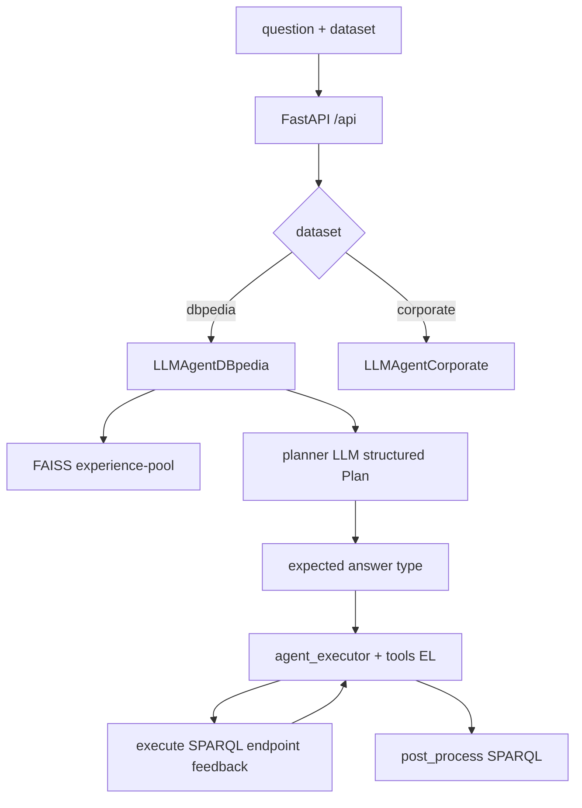

# STATIC_AUDIT — mkgqagent (WAVE_A)

**Fecha auditoría:** 2026-07-19  
**Pinned commit:** `ba0f2f78611a7ccacc8c985a97f6008ef7ee6a6a`  
**Etiquetas:** `README_REPORTED` | `CODE_VERIFIED` | `PAPER_REPORTED` | `NOT_FOUND` | `UNKNOWN`

---

## 1. Identificación y commit

| Campo | Valor | Evidencia |
|---|---|---|
| method_id | `mkgqagent` | lab |
| upstream | `upstream/mkgqagent/` | `CODE_VERIFIED` |
| repo | WSE-research/text2sparql-agent | lock |
| tag en HEAD | `v1.0.0-TEXT2SPAQL-ESWC2025` (typo SPAQL) | lock / clon |
| entry | FastAPI `main:app` | `CODE_VERIFIED` `main.py:10-54` |

## 2. Relación paper↔repositorio

| Afirmación | Etiqueta |
|---|---|
| Implementación challenge TEXT2SPARQL ESWC 2025 / CEUR | `PAPER_REPORTED` + `README_REPORTED` |
| CITATION.cff presente | `CODE_VERIFIED` |
| Offline SAgent + online mKGQAgent | `README_REPORTED` README.adoc L46–61; online en código sí |

## 3. Estado legal

| Campo | Valor | Evidencia |
|---|---|---|
| LICENSE file | **ausente** | `CODE_VERIFIED` `NOT_FOUND` |
| license_status | `LICENSE_NOT_CONFIRMED` | lab `LICENSE_MATRIX` |
| Gate adapters | **blocked** | inspección OK; no copiar/integrar |

## 4. Arquitectura

Servicio FastAPI que instancia dos agentes (`LLMAgentDBpedia`, `LLMAgentCorporate`) y expone `GET /api?question=&dataset=` (`main.py:24-50`).

Flujo online (`CODE_VERIFIED` `llm_agent_dbpedia.py`):

1. Carga embeddings HF + FAISS experience pool.  
2. ICL: similarity search top-N ejemplos.  
3. LangGraph: `planner` → `eat` → `agent` (tool-calling) ↔ `feedback` (ejecuta SPARQL en endpoint) → SPARQL post-procesado.

## 5. Diagrama Mermaid

Ver §4.

## 6. Entry points

| Entrypoint | Evidencia |
|---|---|
| `uvicorn main:app --host 0.0.0.0 --port 8000` | `CODE_VERIFIED` Dockerfile L20; `main.py:52-54` |
| Docker image `wseresearch/kgqagent-text2sparql` | `README_REPORTED` |
| `python main.py` | `CODE_VERIFIED` |
| Notebook `experiments/test_questions.ipynb` | presente (no ejecutado) |

## 7. Componentes y responsabilidades

| Path | Rol | Evidencia |
|---|---|---|
| `main.py` | API TEXT2SPARQL-compatible | L10–50 |
| `model/agent.py` | estado `PlanExecute` | L5–13 |
| `services/llm_agent_dbpedia.py` | agente DBpedia | plan/action/feedback |
| `services/llm_agent_corporate.py` | agente corporate | análogo |
| `services/llm_utils.py` | tools `dbpedia_el`, Falcon, corporate EL, Plan schema | L31–89 |
| `services/ld_utils.py` | `execute` SPARQL + `post_process` | importado |
| `prompts/dbpedia.py`, `prompts/corporate.py` | system/planner/feedback prompts | imports |
| `data/experience-pool/*` | FAISS prebuilt | dirs `qald_9_plus_train_dbpedia_en`, `corporate_en` |
| `data/datasets/*.json` | ICL source JSON | L58–60 agent |
| `data/evaluation/*.yaml` | configs evaluación challenge | presentes |

## 8. Entrada y salida observables

| | Valor | Evidencia |
|---|---|---|
| Entrada API | `question: str`, `dataset: str` (IRIs challenge) | `main.py:16-18,25` |
| Salida | JSON `{dataset, question, query}` SPARQL | `main.py:46-50` |
| Fallback error | SELECT genérico LIMIT 10 | `llm_agent_dbpedia.py:237-241` |

## 9. Dependencias y runtimes

`requirements.txt` `CODE_VERIFIED`: fastapi, uvicorn, langgraph, langchain-openai, langchain-community, sentence-transformers, faiss-cpu, SPARQLWrapper, rdflib, fuzzywuzzy.

Python 3.10 (Dockerfile). **No training** en servicio online.

## 10. Variables de entorno y secretos

| Nombre | Evidencia |
|---|---|
| `OPENAI_API_KEY` | `README_REPORTED` L81+; CI workflow |
| `CORPORATE_SERVICE_BASE_URL` | `CODE_VERIFIED` `llm_utils.py:96` default `http://141.57.8.18:9199` |

ChatOpenAI usa key OpenAI estándar del entorno (`CODE_VERIFIED` uso langchain_openai).

## 11. Servicios externos

| Servicio | Evidencia |
|---|---|
| OpenAI API (`gpt-4o-2024-05-13`) | agent `__init__` L34,70-78; README L74 |
| DBpedia SPARQL `http://141.57.8.18:40201/dbpedia/sparql` | `CODE_VERIFIED` L42 |
| Falcon2 EL `https://labs.tib.eu/falcon/falcon2/api` | `llm_utils.py:44-57` |
| Corporate entity service host WSE | `llm_utils.py:96` |
| LangChain hub prompt `hwchase17/openai-functions-agent` | L75 — **requiere red** |

## 12. Datasets y splits

| Path | Rol |
|---|---|
| `data/datasets/qald_9_plus_train_dbpedia_en.json` | ICL / pool source |
| `data/datasets/corporate_en.json` | corporate |
| `data/evaluation/*.yaml` | evaluación challenge |
| Offline train script regenerando pool | **`NOT_FOUND`** como script dedicado; pool **prebuilt** |

## 13. Modelos y checkpoints

| Modelo | Rol | Evidencia |
|---|---|---|
| `gpt-4o-2024-05-13` | LLM plan/agent | `CODE_VERIFIED` |
| `intfloat/multilingual-e5-large` | embeddings CPU | L35,48-54 `device: cpu` |
| FAISS indexes | experience pool | `data/experience-pool/` |
| Fine-tune checkpoints | `NOT_FOUND` | API |

## 14. Prompts

`prompts/dbpedia.py`, `prompts/corporate.py` — system, planner, feedback, last_task (`CODE_VERIFIED` imports).

## 15. Evaluación y métricas originales

| Elemento | Etiqueta |
|---|---|
| Compatible API TEXT2SPARQL challenge | `README_REPORTED` |
| `data/evaluation/` YAMLs | `CODE_VERIFIED` presencia |
| Offline F1=1 storage en pool | `README_REPORTED` — código offline de construcción **no** hallado como módulo |
| Métricas paper CEUR | `PAPER_REPORTED` (audit previa) |

## 16. Comando documentado por autores

`README_REPORTED`: export `OPENAI_API_KEY`; `pip install -r requirements.txt`; `uvicorn` / Docker run puerto 8000; curl a `/api`.

## 17. Comando todavía no verificado

Install, descarga e5-large, arranque API, llamadas OpenAI — **no ejecutados**.

## 18. Compatibilidad estimada con la máquina

| Aspecto | Clase |
|---|---|
| API + OpenAI + embeddings CPU | `feasible_using_api` con riesgo RAM (e5-large ~RAM alta en 7.4 GiB) |
| Endpoints WSE hardcodeados | dependencia red/servicio ajeno |
| Docker run (sin compose) | viable si imagen/build |
| Rebuild offline pool | `UNKNOWN` / probablemente costoso API |

## 19. Riesgos de ejecución

- LICENSE_NOT_CONFIRMED.  
- Hosts IP hardcodeados pueden caer.  
- `allow_dangerous_deserialization=True` en FAISS load (L65).  
- LangChain hub pull requiere red.  
- e5-large en CPU puede OOM WSL.  
- Bug potencial `__main__` referencia `el` no definido (L250) — `CODE_VERIFIED` olor; no ejecutar.

## 20. Diferencias README↔código

| README | Código |
|---|---|
| Fase offline SAgent descrita | Solo índices prebuilt; **sin** script offline claro (`NOT_FOUND`) |
| Multilingual | Agent default `lang="en"`; dataset paths `_en` |
| Entity linking tools | Falcon/dbpedia_el activos; wikidata_el parcialmente stubbeado (comentarios L67-68) |

## 21. Artefactos ausentes

- LICENSE  
- Script regeneración experience pool  
- Tests automatizados dedicados (`NOT_FOUND` pytest suite)  
- requirements pins estrictos (versiones mínimas)

## 22. Ruta mínima para smoke futuro

1. venv + `pip install -r requirements.txt` (futuro prompt).  
2. `OPENAI_API_KEY` + verificar acceso endpoint DBpedia WSE o documentar fallo.  
3. `uvicorn main:app` → `GET /api` 1 pregunta DBpedia.  
4. Etiquetar `smoke_only`. **No adapters.**

## 23. Ruta necesaria para reproducción nativa

Challenge evaluation YAMLs + mismos modelos + endpoints paper + métricas F1 challenge; reconstruir offline pool si se exige fidelidad total (código offline ausente → bloqueo parcial).

## 24. Gate legal para futuras adaptaciones

**blocked** (`LICENSE_NOT_CONFIRMED`). Solo inspección / posible smoke aislado sin integración al núcleo lab.

## 25. Conclusión conservadora

Arquitectura online **CODE_VERIFIED** (plan→action→feedback→SPARQL). Offline phase principalmente **README_REPORTED**. Smoke API **conditional** (key, RAM embeddings, endpoints). Legal **blocked** para adapters. `reproduction_status: audit_only`.

---

## Addendum — pasada profunda (subagente estático)

Hallazgos adicionales `CODE_VERIFIED` (sin cambiar el veredicto §25 ni el gate legal):

| Hallazgo | Evidencia / impacto |
|---|---|
| Experience pool online = ICL `question`/`sparql` vía FAISS; **no** trazas F1/plan/tool del paper | `generate_sparql` L206–228; helpers `construct_shot` etc. en `llm_utils.py` sin callers (dead code) |
| Multilingual README vs repo solo `en` | datasets/prompts `*_en` |
| `main.py` instancia **ambos** agentes al import → doble carga e5-large en CPU | Riesgo OOM fuerte en 7.4 GiB; smoke: un proceso/un agente o lazy-init futuro |
| Inconsistencia `last_task` (dict) añadido entero al plan vs `last_task[lang]` | `llm_agent_dbpedia.py` ~L94 vs `prompts/dbpedia.py` |
| Planner prompt JSON `{"plan":...}` vs schema Pydantic campo `steps` | `prompts/dbpedia.py` vs `llm_utils.Plan` |
| `requirements.txt` omite `requests` pese a uso en `llm_utils` | Fallo latent post-install |
| Cliente `text2sparql-client` **no** en requirements (externo pipx) | Eval challenge documentada pero no empaquetada |
| Corporate sin nodo EAT (DBpedia sí) | Diferencia de grafo entre agentes |
