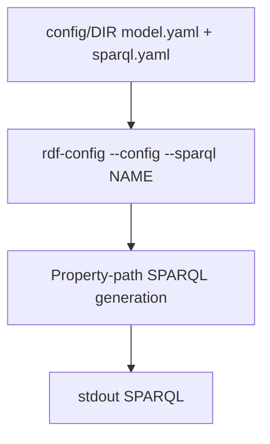

# COMPANION_RDF_CONFIG_AUDIT — dbcls/rdf-config

**Fecha:** 2026-07-19  
**Upstream lab:** `upstream/rdfconfig_llm_rdf-config/`  
**Pinned commit:** `cccc581c16f0b24865030bc5459475a9d0fcbd5f`  
**También vendorizado dentro del generator:** `upstream/rdfconfig_llm/rdf-config/` (puede diferir del pin companion)

---

## 1. Identificación

| Campo | Valor | Evidencia |
|---|---|---|
| Proyecto | RDF-config | README |
| Lenguaje | Ruby | Gemfile, gemspec |
| Licencia | MIT | `CODE_VERIFIED` `LICENSE` |
| CLI | `rdf-config` (gem executable `bin/`) | gemspec `bindir=bin` |

## 2. Rol respecto al paper / generator

Herramienta **independiente** que genera SPARQL (y schema/ShEx/Grasp) desde YAML (`model.yaml`, `sparql.yaml`). El paper/generator Python **no** genera SPARQL con el LLM: el LLM elige variables/params; rdf-config construye la query (`CODE_VERIFIED` vía `rdf_config_executer.py` en el generator).

## 3. Estado legal

**MIT** confirmado. Reutilizable. **No** transfiere licencia al wrapper Python `scott2121`.

## 4–5. Arquitectura / flujo



## 6. Entry points

`README_REPORTED` / docs:

```bash
bundle exec rdf-config --config config/<name> --sparql <query_name>
bundle exec rdf-config --config config/<name> --query <vars>
```

Docker Hub `dbcls/rdf-config` también documentado.

## 7. Componentes

| Área | Notas |
|---|---|
| `config/*` | muchos DBs (bgee, uniprot, mesh, dbpedia, …) |
| `doc/spec.md` | especificación YAML |
| Generación SPARQL | desde lista `variables` + `parameters` |
| Tests | presentes en árbol Ruby (no ejecutados) |

## 8. I/O

Entrada: directorio config YAML. Salida: SPARQL / SVG schema / ShEx según flags.

## 9. Runtime

Ruby + Bundler (`Gemfile`/`Gemfile.lock`). Sin Python.

## 10–11. Env / servicios

No OpenAI. Endpoints pueden estar en YAML config; ejecución SPARQL **no** es el foco principal del CLI (generación sí).

## 12. Datasets

Configs de ejemplo por DB en `config/` — no son el benchmark del paper (esas questions viven en el generator Python).

## 13–15. Modelos / prompts / métricas

N/A (no LLM). Métricas paper viven en generator.

## 16–17. Comandos

Documentados en README companion; **no verificados** por ejecución en lab.

## 18. Máquina

`feasible_local_cpu` tras instalar Ruby/Bundler. Ligero vs LLMs.

## 19. Riesgos

Divergencia entre pin companion y copia dentro de `rdfconfig_llm/rdf-config/`. Smoke del método debe fijar **un** árbol y documentarlo.

## 20. README↔código

Alineado: herramienta YAML→SPARQL madura.

## 21. Artefactos

Completos para uso como dependencia.

## 22. Smoke mínimo companion

`bundle install` + `bundle exec rdf-config --config config/bgee --sparql` (listar queries) — **futuro**, no este prompt.

## 23. Reproducción nativa del paper

Insuficiente solo: requiere generator Python + OpenAI + questions.

## 24. Gate legal

**allowed** (MIT) para uso/adaptación del companion **separado** del generator LICENSE_NOT_CONFIRMED.

## 25. Conclusión

Companion claro, MIT, frontera bien definida. Mantener audits y paths separados del generator.
