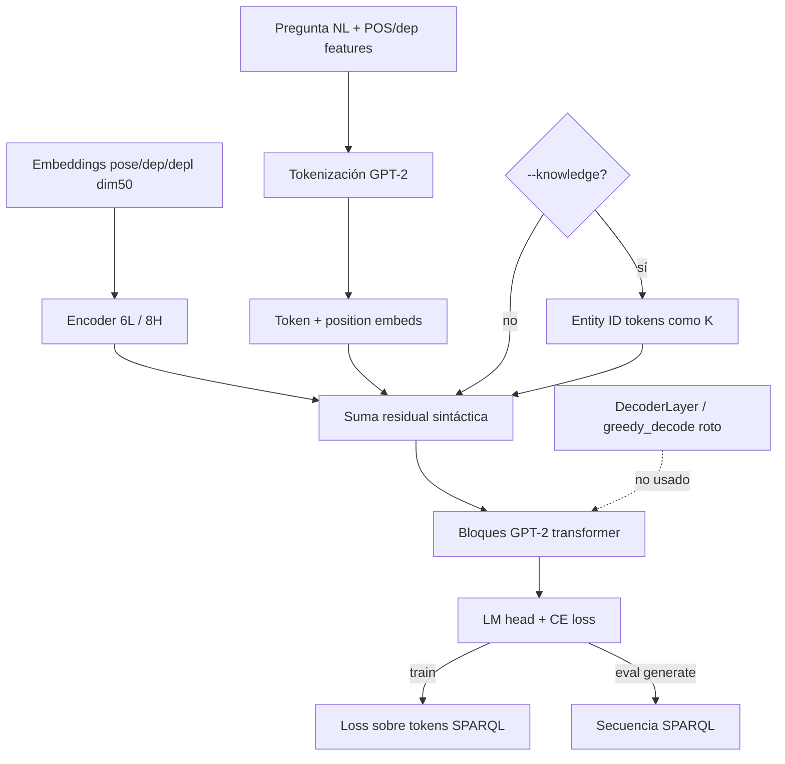

# Arquitectura y flujo de datos — SGPT

**Fecha:** 2026-07-20  
**Fuente principal:** `scripts/model.py` (`CODE_VERIFIED`)  
**Commit:** `1f6964d1c3bfee50c7dec2c25546f32b4ab94b2b` (`PIN`)

---

## Resumen

SGPT es un modelo generativo text→SPARQL basado en **GPT-2** con un **encoder Transformer de 6 capas / 8 cabezas** sobre embeddings sintácticos (POS, tipo de dependencia, nivel de dependencia; tamaño 50). La salida del encoder se **suma** a los embeddings token+posición antes de los bloques GPT-2. La cabeza LM (`GPT2LMHeadModel`) + `CrossEntropyLoss` genera SPARQL como secuencia de tokens.

---

## Componentes (`CODE_VERIFIED`)

| Pieza | Detalle |
|---|---|
| Base | `GPT2PreTrainedModel` / GPT-2 HF (`model_name_or_path: gpt2`) |
| Embeddings sintácticos | `pose`, `dep`, `depl` (dim 50) |
| Encoder custom | 6 capas, 8 heads sobre features sintácticas |
| Fusión | salida encoder ⊕ (token + position embeds) → bloques GPT-2 |
| Cabeza | `GPT2LMHeadModel` + CE loss LM |
| Entrada | tokens de pregunta + opcional IDs de entidades K + features sintácticas |
| Salida | tokens de string SPARQL |
| EL / RL en inferencia | **no** hay módulos (`CODE_VERIFIED`) |
| Consulta ontología/KG en inferencia | **no**; URIs aprendidas de datos (`CODE_VERIFIED`) |

### Código muerto / no usado en train·eval

- Stack `DecoderLayer` presente pero no en el path activo.
- `greedy_decode` referencia atributos indefinidos (`enc_layer_stack`, etc.) — **no** usado por train/eval.

---

## Variantes de entrada

| Modo | Mecánica | Evidencia |
|---|---|---|
| Sin `--knowledge` (≈ **SGPT_Q**) | text-to-SPARQL end-to-end | `PAPER_REPORTED` nombre; `CODE_VERIFIED` ausencia de flag |
| Con `--knowledge` (≈ **SGPT_Q_K**) | entidades adicionales como K (README: solo entities) | `README_REPORTED` + `CODE_VERIFIED` |
| `--masked` (ortogonal) | `maskit`: superficies → `ENT{i}` en pregunta y IDs en SPARQL; docstring menciona relations pero el loop **solo** entidades | `CODE_VERIFIED` |

### Provenance de K por dataset

| Dataset | `format_knowledge` | Nota |
|---|---|---|
| LC-QuAD 2.0 | desde `new_LabelsEnt` (`label: QID`); solo QIDs que aparecen en gold `sparql_wikidata` | `INFERENCE`: filtrado gold-SPARQL; paper dice “entities mentioned in the question are provided” |
| QALD-9 / VQuAnDa | lista `item["entities"]` (nombres recurso DBpedia) **sin** filtrar vs SPARQL en código | `CODE_VERIFIED` |

---

## Diagrama Mermaid

---

## Flujo train → eval

1. Cargar split procesado (`data/{dataset}/{split}.json`) con POS/dep IDs.
2. Opcional: `--masked` / `--knowledge`.
3. `train.py`: fine-tune; descarga `gpt2` de Hugging Face si falta (red).
4. Checkpoints → `runs/sgpt/{dataset}/` (+ `checkpoint-*` por época) — **no presentes en clon**.
5. `eval.py --generate <ckpt>`: genera SPARQL; métricas léxicas en `utils/metrics.py` (ver `METRICS_AUDIT.md`).

---

## Lo que el sistema no hace

- Entity linking / relation linking en inferencia.
- Ejecución SPARQL ni Answer F1.
- Consulta al KG/ontología en runtime.
