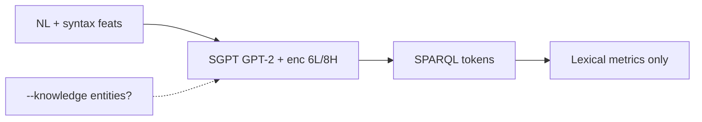

# STATIC_AUDIT — sgpt (WAVE_B)

**Fecha auditoría:** 2026-07-20  
**Upstream:** `upstream/sgpt/`  
**Pinned commit:** `1f6964d1c3bfee50c7dec2c25546f32b4ab94b2b` (`PIN`)  
**Paper:** IEEE Access 2022, DOI [10.1109/ACCESS.2022.3188714](https://doi.org/10.1109/ACCESS.2022.3188714) (`PIN`)  
**Etiquetas de evidencia:** `PIN` | `CODE_VERIFIED` | `DATA_VERIFIED` | `README_REPORTED` | `PAPER_REPORTED` | `INFERENCE` | `NOT_FOUND` | `UNKNOWN` | `MISMATCH`

**Restricción de esta pasada:** solo escritura de artefactos de auditoría; **sin** training, `pip install`, ni import de `torch` / `transformers` / `spacy` / `nltk` / sgpt.

**Documentos satélite:**  
`REPOSITORY_INVENTORY.md` · `CHECKPOINT_AND_RESULTS_INVENTORY.md` · `ARCHITECTURE_AND_DATA_FLOW.md` · `CONFIGURATION_AND_VARIANTS_MATRIX.csv` · `DATASET_INVENTORY.csv` · `DATASET_PROVENANCE_AND_SPLITS.md` · `TRAINING_CONFIGURATION_AUDIT.md` · `METRICS_AUDIT.md` · `PAPER_TABLE4_CODE_MAPPING.csv` · `DEPENDENCY_AND_RUNTIME_AUDIT.md` · `EXECUTION_READINESS.md` · `../WAVE_B_STATIC_AUDIT_MATRIX.csv`

---

## 1. Identificación y commit

| Campo | Valor | Evidencia |
|---|---|---|
| method_id | `sgpt` | lab |
| upstream | `upstream/sgpt/` | `CODE_VERIFIED` |
| pinned_commit | `1f6964d1c3bfee50c7dec2c25546f32b4ab94b2b` | `PIN` / lock |
| remoto | https://github.com/rashad101/SGPT-SPARQL-query-generation | lock |
| archivos (excl. `.git_local`) | 43 | `REPO` |
| tamaño | ~218 M (mayormente `data/`) | `REPO` |

---

## 2. Relación paper↔repositorio

| Afirmación | Etiqueta | Notas |
|---|---|---|
| Repo oficial autores | `PAPER_REPORTED` / lab | `METHOD_REGISTRY.yaml` |
| Venue IEEE Access 2022 | `PIN` / `README_REPORTED` | DOI 10.1109/ACCESS.2022.3188714 |
| Table 4 cerrada (valores reportados) | `PAPER_REPORTED` | `RESULT_EVIDENCE_MATRIX.csv` |
| Código ≈ GPT-2 + encoder sintáctico text→SPARQL | `CODE_VERIFIED` | `scripts/model.py` |

---

## 3. Estado legal

| Campo | Valor | Evidencia |
|---|---|---|
| license_status | `CONFIRMED_LICENSE_FILE` | `upstream/sgpt/LICENSE.md` |
| SPDX | MIT | `PIN` |
| Gate adapters | **no** (`common_adapter_allowed: false`) hasta native audit | protocolo lab |

---

## 4. Arquitectura

Base **GPT-2** (`GPT2PreTrainedModel`); `GPT2Model` custom con embeddings `pose`/`dep`/`depl` (dim 50); encoder Transformer **6 capas / 8 heads** sobre sintaxis; salida sumada a token+position embeds; `GPT2LMHeadModel` + CE LM genera SPARQL token a token (`CODE_VERIFIED`).

Código muerto: stack `DecoderLayer`; `greedy_decode` con attrs indefinidos — fuera del path train/eval (`CODE_VERIFIED`).

Detalle + Mermaid: `ARCHITECTURE_AND_DATA_FLOW.md`.

---

## 5. Diagrama Mermaid



Ver diagrama completo en `ARCHITECTURE_AND_DATA_FLOW.md`.

---

## 6. Entry points

| Entrypoint | Rol | Evidencia |
|---|---|---|
| `train.py` | fine-tune | `CODE_VERIFIED` / `README_REPORTED` |
| `eval.py` | generate + métricas | `CODE_VERIFIED` / `README_REPORTED` |
| `measure.py` | helpers medición | `CODE_VERIFIED` |
| `python -m torch.distributed.launch train.py …` | multi-GPU | `README_REPORTED` |

---

## 7. Componentes y responsabilidades

| Componente | Path | Rol | Evidencia |
|---|---|---|---|
| Modelo | `scripts/model.py` | arquitectura SGPT | `CODE_VERIFIED` |
| Datasets | `scripts/dataset_*.py` | LC-QuAD2 / QALD9 / VQuAnDa | `CODE_VERIFIED` |
| CLI args | `utils/args.py` | `--knowledge`, `--masked`, `--epochs`, … | `CODE_VERIFIED` |
| Métricas | `utils/metrics.py` | BLEU/F1/SP/METEOR/ROUGE | `CODE_VERIFIED` |
| Params | `config/gpt-2-base/params.json` | HPs | `CODE_VERIFIED` |
| Features árbol | `utils/dptree.py` | dep levels | `CODE_VERIFIED` |

---

## 8. Entrada y salida observables

| | Valor | Evidencia |
|---|---|---|
| Entrada | pregunta (+ syntax); opcional entity IDs K; opcional masking `ENT{i}` | `CODE_VERIFIED` |
| Salida | string SPARQL tokenizado | `CODE_VERIFIED` |
| Side effects train | `runs/sgpt/{dataset}/`, `checkpoint-*`; descarga HF `gpt2` | `CODE_VERIFIED` (artefactos **ausentes** en clon) |

---

## 9. Dependencias y runtimes

Python 3.8 (`README_REPORTED`); `torch==1.13.1`; `transformers` unpinned; spaCy+`en_core_web_sm`; NLTK; Apex opcional; `optuna-dashboard`; `tensorboardx` (`CODE_VERIFIED` / `README_REPORTED`). Host: Python 3.10.12, RTX 4050 6 GiB, RAM WSL ~7.4 GiB (`MACHINE_PROFILE`). Detalle: `DEPENDENCY_AND_RUNTIME_AUDIT.md`.

---

## 10. Variables de entorno y secretos

No se identificó `.env` / API keys obligatorias para el path local GPT-2 (`CODE_VERIFIED` estático). Hugging Face cache/token puede aplicar en entornos restringidos (`UNKNOWN` política HF del host). Sin secretos leídos en esta auditoría.

---

## 11. Servicios externos

| Servicio | Uso | Evidencia |
|---|---|---|
| Hugging Face Hub | descarga `gpt2` en primer train | `CODE_VERIFIED` |
| Endpoint Wikidata/DBpedia en inferencia | **no** usado por el modelo | `CODE_VERIFIED` |
| EL/RL services | **no** | `CODE_VERIFIED` |

---

## 12. Datasets y splits

| Dataset | Train / Val / Test | KG | Evidencia |
|---|---|---|---|
| lcquad2 | 21497 / 2389 / **5969** | Wikidata | `DATA_VERIFIED` |
| qald9 | 350 / 58 / 150 | DBpedia | `DATA_VERIFIED` |
| vquanda | 3500 / 500 / 1000 | DBpedia | `DATA_VERIFIED` |

Paper Table 2 a menudo cita test LC-QuAD **6046** → **MISMATCH** (−77). lcquad2/vquanda: sin overlap de IDs entre splits; **qald9 train∩test = 150 IDs** (contenido `en_ques`+`sparql` no idéntico). Checksums: `logs/static-audit-sgpt/*`. Ver `DATASET_PROVENANCE_AND_SPLITS.md`, `DATASET_INVENTORY.csv`.

---

## 13. Modelos y checkpoints

| Artefacto | Estado | Evidencia |
|---|---|---|
| GPT-2 base HF | no vendored; se descarga | `NOT_FOUND` local + train path |
| Checkpoints fine-tune / `runs/` | **ausentes** | `NOT_FOUND` |
| Tokenizer files | **ausentes** | `NOT_FOUND` |
| Paper Table 4 pesos | no en Git | `PAPER_REPORTED` claim vs repo |

→ Inferencia **blocked**. Ver `CHECKPOINT_AND_RESULTS_INVENTORY.md`.

---

## 14. Prompts

N/A — método entrenado, no prompt ICL (`METHOD_REGISTRY` / `CODE_VERIFIED`).

---

## 15. Evaluación y métricas originales

Léxicas únicamente (BLEU, unigram P/R, SP-* con norm. variables, METEOR, ROUGE). Sin ejecución SPARQL / Answer F1 / EM primario. Anomalías: double `update`, F1 no en `result` dict, BLEU≡SPBLEU class, div/0 risk. Ver `METRICS_AUDIT.md`. Table 4: `PAPER_TABLE4_CODE_MAPPING.csv`.

---

## 16. Comando documentado por autores

```bash
conda create -n sgpt -y python=3.8 && source activate sgpt
pip install -r requirements.txt
python -m spacy download en_core_web_sm
python train.py --dataset lcquad2 --epochs 40
python -u eval.py --generate runs/sgpt/lcquad2/ --dataset lcquad2 \
  --generation_params_file config/gpt-2-base/generation_params.json \
  --eval_dataset test --output_file outputs/predictions_gpt2-base.json
```

(`README_REPORTED` — **no ejecutado** aquí.)

---

## 17. Comando todavía no verificado

Cualquier `pip install`, import torch/transformers, train, eval, o descarga HF en este host — **no verificado** (restricción Prompt WAVE_B static).

---

## 18. Compatibilidad estimada con la máquina

| Aspecto | Clase | Nota |
|---|---|---|
| DATA_ONLY inventory | ready | hecho |
| Import / load GPT-2 | conditional | env + red + VRAM |
| Inferencia | blocked | sin ckpt |
| Reduced training smoke | conditional futuro | etiquetar smoke_only |
| Native = Table 4 | not_ready | 6 GiB vs 2×12 GB; mismatch 5969/6046; métricas |

---

## 19. Riesgos de ejecución

- OOM en 6 GiB con batch efectivo 16.
- `--device` ignorado; fuerza `cuda:0`.
- Bug risk `--epochs == -1` sobrescribe JSON (`train.py` L267).
- `transformers` unpinned vs torch 1.13.1.
- Double-count métricas → cifras no comparables ciegamente a Table 4.
- `eval_only` incompleto (`pass`).
- Selección de checkpoint unclear (no best-only).

---

## 20. Diferencias README↔código↔paper

| Tema | README / paper | Código / datos |
|---|---|---|
| Epochs | 40 ejemplo; probar hasta 70 | `params.json` = 70; CLI bug si −1 |
| LR | 6e-4 o 6e-5 | `6.25e-5` en JSON |
| Test LC-QuAD | ~6046 (Table 2) | **5969** local |
| K entities | “mentioned in question” | LC-QuAD: filtro gold SPARQL (`INFERENCE`); QALD/VQuAnDa: lista sin filtro |
| `--masked` relations | docstring | solo entidades en loop |
| Device CLI | expuesto | sobrescrito |

---

## 21. Artefactos ausentes

`pytorch_model.bin`, safetensors, `checkpoint-*`, `runs/`, `outputs/`, `tokenizer.json`/`merges.txt`/`vocab.json`, `training_args.bin`, `eval_results.txt`, TensorBoard — todos `NOT_FOUND` (`REPO`).

---

## 22. Variantes SGPT_Q / SGPT_Q_K / masked

| Variante | Flags | Evidencia |
|---|---|---|
| SGPT_Q | sin `--knowledge` | `PAPER_REPORTED` + `CODE_VERIFIED` |
| SGPT_Q_K | `--knowledge` (solo entities) | `README_REPORTED` |
| masked | `--masked` ortogonal | `CODE_VERIFIED` |

Matriz: `CONFIGURATION_AND_VARIANTS_MATRIX.csv`.

---

## 23. Ruta mínima para smoke futuro

**A) DATA_ONLY (recomendado inmediato):** revalidar conteos/checksums ya en `logs/static-audit-sgpt/` — **no** es reproducción.

**B) REDUCED_TRAINING_SMOKE (condicional):** env Python+torch pin; 1–few batches / 1 epoch / subset; etiquetar `smoke_only` — **no** native / **no** Table 4.

**C) Inferencia:** solo tras ckpt propio o externo documentado.

---

## 24. Ruta necesaria para reproducción nativa

1. Entorno Python 3.8 (o validar 3.10) + pins torch/transformers/spacy/nltk.  
2. Red para `gpt2`.  
3. GPU ≥ paper o documentar degradación (host **no** cumple 2×12 GB).  
4. Train con flags exactos Q / Q_K (± masked) y criterio de checkpoint **aclarado**.  
5. Eval léxica con conciencia de anomalías double-update.  
6. Comparar vs Table 4 etiquetando mismatch split 5969↔6046.  
7. **Estado actual:** `native_reproduction = not_ready`.

---

## 25. Adaptabilidad futura al caso de estudio (KG modelos de IA)

Análisis estático (no implementación):

| Pregunta | Respuesta | Evidencia |
|---|---|---|
| ¿Consulta ontología en inferencia? | No | `CODE_VERIFIED` |
| ¿Usa clases/propiedades dominio-rango? | No | `CODE_VERIFIED` |
| ¿Accede al KG en generación? | No | `CODE_VERIFIED` |
| ¿Solo aprende URIs desde datos? | Sí | `CODE_VERIFIED` |
| ¿Recibe entidades preanotadas? | Sí, si `--knowledge` | `CODE_VERIFIED` |
| ¿Cambio de KG sin reentrenar? | No viable: vocabulario URI/prefijos en datos | `INFERENCE` |
| Trabajo para KG de modelos de IA | Nuevo corpus Q↔SPARQL + features sintácticas + reentrenamiento; oráculo de entidades si se usa Q_K | `INFERENCE` |

Adapters comunes: **no** crear en esta fase (`common_adapter_allowed: false`).

---

## 26. Conclusión conservadora

Auditoría estática WAVE_B de SGPT: **completa a nivel de comprensión estática** (código, datos, configs, métricas, readiness).  

- `reproduction_status` permanece **`audit_only`**.  
- `DATA_ONLY_CHECK`: ready.  
- `import_or_model`: unknown/conditional.  
- `inference_with_checkpoint`: **blocked**.  
- `reduced_training`: conditional futuro.  
- `native_reproduction`: **not_ready**.  

**Siguiente paso lab recomendado:** auditoría estática **WAVE_C** (CoT-SPARQL y FIRESPARQL). Cualquier ejecución futura de SGPT debe etiquetarse como **DATA_ONLY** o **reduced training smoke**, **nunca** como reproducción nativa del paper.
