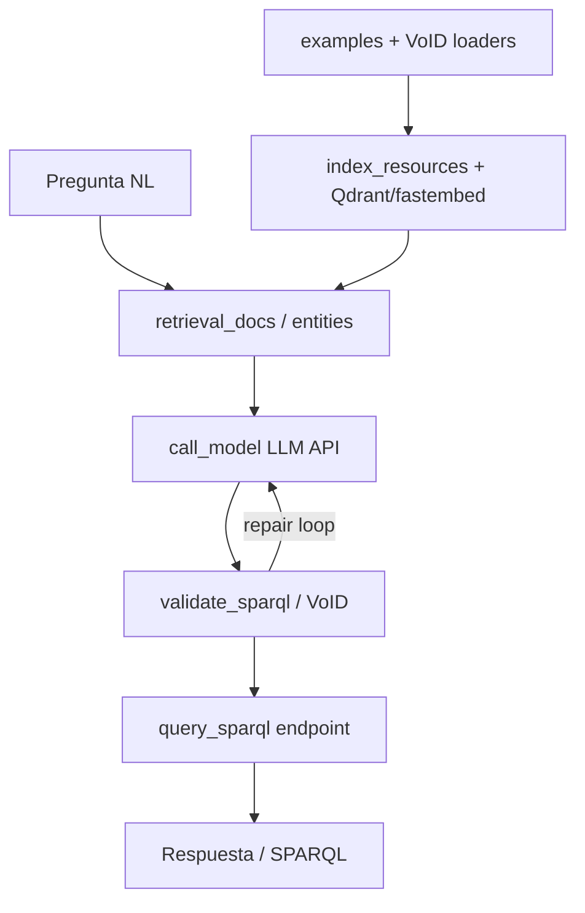

# STATIC_AUDIT — sparql_llm (WAVE_A)

**Fecha auditoría:** 2026-07-19  
**Lab commit al inicio:** `7e8cad3dc7dfc9485431de03585ac2b7cb4a3934`  
**Etiquetas de evidencia:** `README_REPORTED` | `CODE_VERIFIED` | `PAPER_REPORTED` | `NOT_FOUND` | `UNKNOWN`

---

## 1. Identificación y commit

| Campo | Valor | Evidencia |
|---|---|---|
| method_id | `sparql_llm` | lab |
| upstream | `upstream/sparql_llm/` | `CODE_VERIFIED` |
| pinned_commit | `3748730e3bd2df2595280b918269fdaadb9fc0c3` | `REPOSITORIES.lock.yaml`; `.git_local` HEAD |
| package name | `sparql-llm` | `CODE_VERIFIED` `pyproject.toml:3` |
| Python | `>=3.10` | `CODE_VERIFIED` `pyproject.toml:2` |
| CLI script | `sparql-llm` → `sparql_llm.mcp_server:cli` | `CODE_VERIFIED` `pyproject.toml:109-110` |

## 2. Relación paper↔repositorio

| Afirmación | Etiqueta | Notas |
|---|---|---|
| Repo oficial autores SIB | `PAPER_REPORTED` / lab audit | ver `audit/PAPER_CODE_MAPPING.md` |
| Preprint under review arXiv:2512.14277 | `PAPER_REPORTED` | `METHOD_REGISTRY.yaml` |
| Código = stack Expasy chat + paquete reutilizable + MCP | `CODE_VERIFIED` + `README_REPORTED` | README L11–17; `src/sparql_llm/` |

## 3. Estado legal

| Campo | Valor | Evidencia |
|---|---|---|
| license_status | `CONFIRMED_LICENSE_FILE` | `LICENSE.txt` presente |
| SPDX | MIT | `pyproject.toml:6,21`; `LICENSE.txt` |
| Gate adapters | **allowed** (tras auditoría nativa) | MIT confirmado |

## 4. Arquitectura

Cuatro capas distinguibles (`CODE_VERIFIED`):

1. **Paquete reutilizable** — loaders, validación SPARQL, utils (`src/sparql_llm/loaders/`, `validate_sparql.py`, `utils.py`).
2. **Servidor MCP** — `src/sparql_llm/mcp_server.py` (`FastMCP`, tools retrieve/execute).
3. **Chat / agent stack** — `src/sparql_llm/agent/` (LangGraph nodes: retrieval, LLM, validation, MCP tools) + webapp estática.
4. **Pipeline evaluación paper / benchmarks** — `tests/benchmark.py`, `tests/benchmark_biodata.py`, `tests/text2sparql/*`.

## 5. Diagrama Mermaid

Ver §4.

## 6. Entry points

| Entrypoint | Tipo | Evidencia |
|---|---|---|
| `sparql-llm` / `mcp_server.cli` | CLI MCP stdio | `CODE_VERIFIED` `pyproject.toml:109-110`; `mcp_server.py:319` |
| `uvx sparql-llm` | README deploy MCP | `README_REPORTED` README L81 |
| HTTP MCP público | `chat.expasy.org/mcp` | `README_REPORTED` |
| Docker Compose stack | `compose.yml` api+vectordb | `CODE_VERIFIED` `compose.yml:1-28`; `README_REPORTED` L312 |
| Benchmarks | `tests/benchmark.py`, `tests/benchmark_biodata.py` | `CODE_VERIFIED` |
| Tutorial | `tutorial/app.py`, `tutorial/mcp_server.py` | `CODE_VERIFIED` |

## 7. Componentes y responsabilidades

| Componente | Path | Rol | Evidencia |
|---|---|---|---|
| Settings / endpoints | `src/sparql_llm/config.py` | lista endpoints SIB, embedding, LLM default | `CODE_VERIFIED` L31–195 |
| Examples loader | `loaders/sparql_examples_loader.py` | ejemplos SPARQL → docs | `CODE_VERIFIED` |
| VoID/shapes loader | `loaders/sparql_void_shapes_loader.py` | esquema/clases | `CODE_VERIFIED` |
| Info loader | `loaders/sparql_info_loader.py` | metadata endpoint | `CODE_VERIFIED` |
| Indexing | `indexing/index_resources.py`, `index_entities.py` | índice vectorial | `CODE_VERIFIED` |
| Validation/repair | `validate_sparql.py` | parse + VoID check | `CODE_VERIFIED` L142+ |
| Endpoint exec | `utils.query_sparql` | ejecución SPARQL | `CODE_VERIFIED` `utils.py:124` |
| Agent graph | `agent/graph.py`, `agent/nodes/*` | orquestación | `CODE_VERIFIED` |
| Prompts | `agent/prompts.py` | prompts sistema | `CODE_VERIFIED` |

## 8. Entrada y salida observables

| | Valor | Evidencia |
|---|---|---|
| Entrada | pregunta NL (+ opc. classes/steps en MCP) | `README_REPORTED` tools; `mcp_server.py` |
| Salida | SPARQL explícito en mensajes / ejecución resultados | `CODE_VERIFIED` extract/validate |
| Side effects | índice Qdrant/local; logs en `./data/logs` | `CODE_VERIFIED` `config.py:185-186` |

## 9. Dependencias y runtimes

| Runtime | Evidencia |
|---|---|
| Python ≥3.10 | `pyproject.toml:2` |
| Core: httpx, rdflib, SPARQLWrapper, mcp, qdrant-client, fastembed, langchain-core | `pyproject.toml:31-44` |
| Optional `agent`: langgraph, langchain-openai, fastapi, uvicorn, pydantic-settings | `pyproject.toml:46-74` |
| Docker imagen API + Qdrant | `Dockerfile`, `compose.yml` |
| `uv`/`uvx` recomendado en README | `README_REPORTED` — **host lab sin uv** (`MACHINE_PROFILE`) |

## 10. Variables de entorno y secretos

| Nombre | Uso | Evidencia |
|---|---|---|
| `SETTINGS_FILEPATH` | JSON settings MCP | `CODE_VERIFIED` `config.py:223` |
| `.env` vía pydantic Settings | endpoints override, keys | `CODE_VERIFIED` `config.py:191-194` |
| `OPENROUTER_API_KEY` | LLM OpenRouter | `CODE_VERIFIED` `agent/utils.py:27` |
| `LANGFUSE_SECRET_KEY` | tracing opcional | `CODE_VERIFIED` `agent/main.py:42` |
| `VECTORDB_URL` | compose → api | `CODE_VERIFIED` `compose.yml:22` |
| `chat_api_key`, `logs_api_key`, `sentry_url` | campos Settings | `CODE_VERIFIED` `config.py:179-183` |

No se leyeron valores secretos en esta auditoría.

## 11. Servicios externos

- Endpoints SPARQL SIB (UniProt, Bgee, OMA, …) — `config.py:35-111` `CODE_VERIFIED`
- LLM vía OpenRouter / OpenAI-compatible — `README_REPORTED` + `default_llm_model` `config.py:147`
- Qdrant (compose) o path local `data/vectordb` — `config.py:131`
- MCP público chat.expasy.org — `README_REPORTED`

## 12. Datasets y splits

| Artefacto | Estado | Evidencia |
|---|---|---|
| `tests/text2sparql/queries.csv` (~88 MB) | presente | `CODE_VERIFIED` (tamaño en clon) |
| Transformadores QALD-9 Plus / LC-QuAD | scripts | `CODE_VERIFIED` `tests/text2sparql/query_transform.py:99-128` |
| VoID ejemplo UniProt | `tests/void_uniprot.ttl` | referenciado `config.py:43` |
| Splits paper exactos | `UNKNOWN` sin ejecutar benchmark | — |

## 13. Modelos y checkpoints

| Modelo | Rol | Evidencia |
|---|---|---|
| `intfloat/multilingual-e5-large` | embeddings docs | `CODE_VERIFIED` `config.py:134` |
| `Qdrant/bm25` | sparse entities | `CODE_VERIFIED` `config.py:141` |
| `openrouter/openai/gpt-5.2` | LLM default | `CODE_VERIFIED` `config.py:147` |
| Checkpoints fine-tune | `NOT_FOUND` en repo | API LLM |

## 14. Prompts

- `src/sparql_llm/agent/prompts.py` — `CODE_VERIFIED`
- `notebooks/EXAMPLE_PROMPT.md` — `CODE_VERIFIED`
- Tutorial slides — `tutorial/slides/`

## 15. Evaluación y métricas originales

| Elemento | Evidencia |
|---|---|
| `tests/benchmark.py` (RAG ± validation, result-set compare) | `CODE_VERIFIED` |
| `tests/benchmark_biodata.py` + pytrec-eval (grupo `bench`) | `CODE_VERIFIED` `pyproject.toml:93-96` |
| Plots resultados | `tests/text2sparql/experiments_results.py` |
| Métricas paper exactas | `PAPER_REPORTED` en audit previa; **no reproducidas aquí** |

## 16. Comando documentado por autores

`README_REPORTED`:

- `pip install sparql-llm` / `uv add sparql-llm`
- `uvx sparql-llm` (MCP)
- `docker compose up` / `compose.prod.yml` + index script

## 17. Comando todavía no verificado

Cualquier install/compose/benchmark en este host — **no ejecutado** (restricción Prompt 4A).

## 18. Compatibilidad estimada con la máquina

| Aspecto | Clase | Nota |
|---|---|---|
| Import paquete / validación offline con VoID local | `feasible_local_cpu` | tras install ligero futuro |
| MCP + API LLM | `feasible_using_api` | necesita key |
| Stack compose completo | **bloqueado localmente** | Compose plugin ausente; Qdrant+API RAM |
| Embeddings e5-large local | riesgo RAM/VRAM WSL 7.4/6 | degradar modelo o API embeddings |
| Eval full paper | `requires_external_gpu` / largo + API coste | no smoke |

## 19. Riesgos de ejecución

- Compose ausente en host.
- Sin `uv`/`uvx` en host (README asume uv).
- Indexación multi-endpoint + Qdrant puede OOM.
- Coste API LLM en benchmarks.
- `queries.csv` grande; no re-descargar.

## 20. Diferencias README↔código

| Tema | README | Código |
|---|---|---|
| Deploy con `uvx` | sí | host lab **sin uv** |
| Compose obligatorio para chat | sí | paquete/MCP pueden usarse sin compose |
| Embedding default | no siempre destacado | `multilingual-e5-large` en Settings |
| LLM default | OpenAI-compatible genérico | `openrouter/openai/gpt-5.2` fijo en Settings |

## 21. Artefactos ausentes

- Checkpoints fine-tune: `NOT_FOUND`
- `.env` de ejemplo en raíz: parcial (Settings lee `.env`; no hay `.env.example` claro en root) — `UNKNOWN`/parcial
- Resultados paper precomputados completos: plots scripts sí; tablas cerradas no garantizadas

## 22. Ruta mínima para smoke futuro

**A) Offline / import (sin API LLM):**  
instalar deps core → import `sparql_llm.validate_sparql` / loaders con `tests/void_uniprot.ttl` → test unitarios `tests/test_components.py` (sin red idealmente limitado).

**B) API smoke:**  
settings JSON mínimo + `OPENROUTER_API_KEY` → CLI MCP o agent con 1 pregunta → etiquetar `smoke_only`.

**C) No confundir con reproducción del paper.**

## 23. Ruta necesaria para reproducción nativa

1. Entorno (Poetry/pip; opcional Docker sin compose vía `docker run` Qdrant).  
2. Indexar endpoints paper/biodata.  
3. Ejecutar `tests/benchmark*.py` con mismos modelos/HPs.  
4. Comparar métricas vs paper (`PAPER_REPORTED`).  
5. Documentar degradaciones máquina.

## 24. Gate legal para futuras adaptaciones

**allowed** (MIT) — solo tras `native_audit_complete` según protocolo lab.

## 25. Conclusión conservadora

`sparql_llm` es el candidato WAVE_A más maduro como **paquete + MCP + eval scripts**, con licencia clara. El stack chat completo depende de Compose/Qdrant/API. **static_understanding: complete**; **api_smoke_ready: conditional** (keys + install); **native_reproduction_ready: conditional** (compose/RAM/coste). `reproduction_status` permanece `audit_only`.
