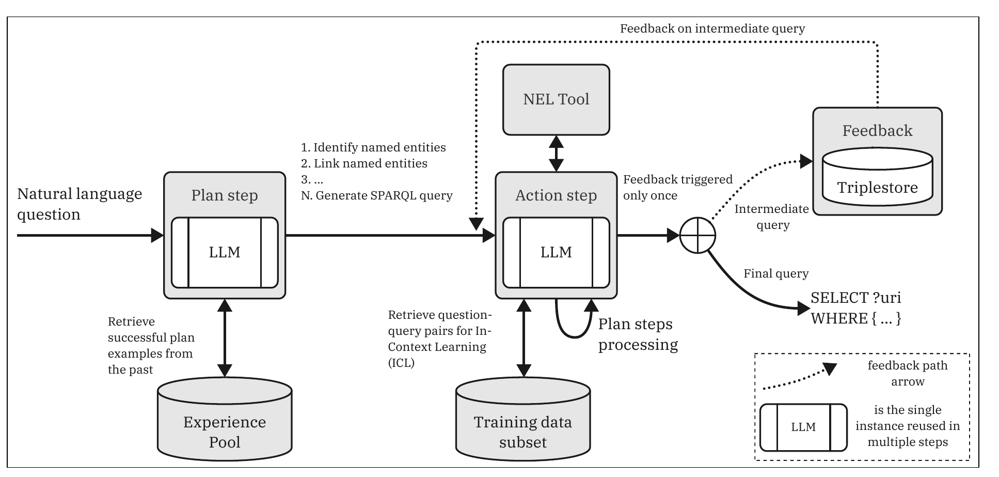
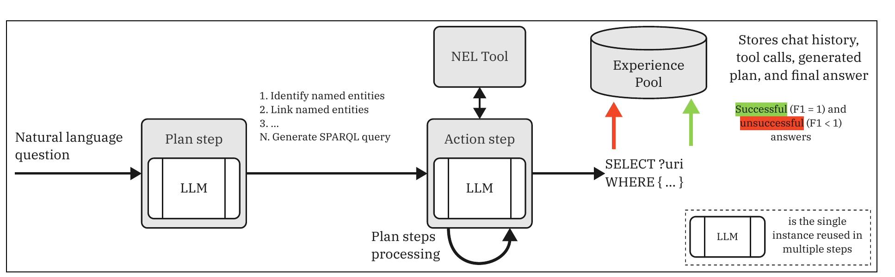
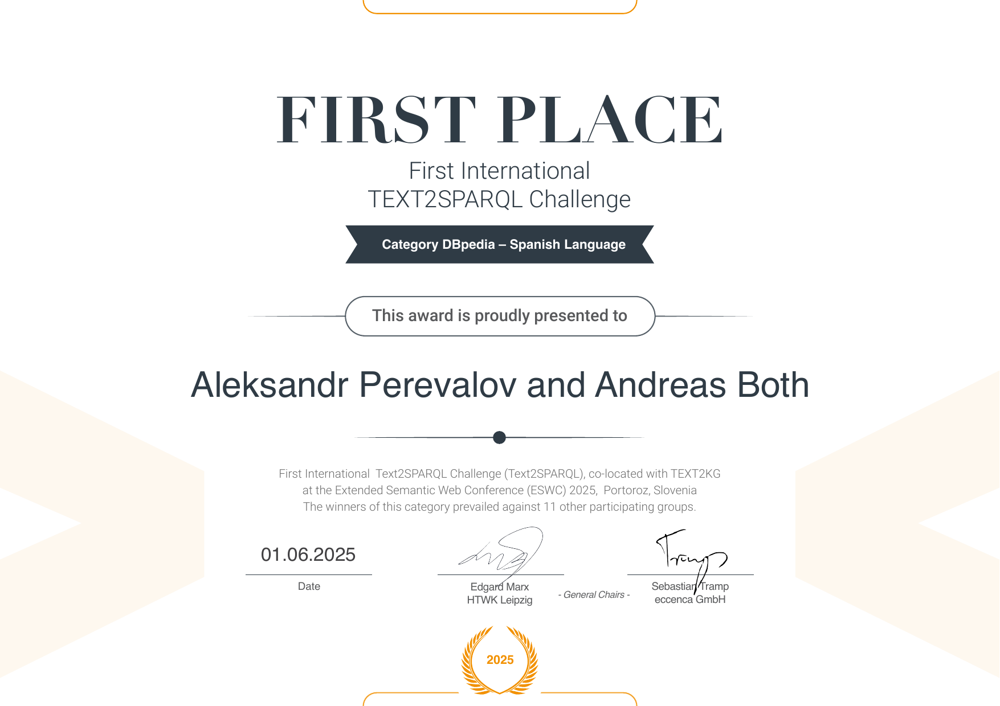

:toc:
:toclevels: 5
:toc-placement!:
:source-highlighter: highlight.js
ifdef::env-github[]
:tip-caption: :bulb:
:note-caption: :information_source:
:important-caption: :heavy_exclamation_mark:
:caution-caption: :fire:
:warning-caption: :warning:
:github-repository: https://github.com/WSE-research/text2sparql-agent
endif::[]

= mKGQAgent -- Multilingual Text-to-SPARQL Agent for Question Answering over Knowledge Graphs

Accessing knowledge via natural-language interfaces is one of the emerging challenges in the field of information retrieval.
Structured knowledge stored in knowledge graphs can be queried via a specific query language (e.g., https://www.w3.org/TR/sparql11-query/[SPARQL]).
Hence, one needs to transform the natural-language input into such a query to fulfill an information need.

This repository provides *mKGQAgent* -- a human-inspired LLM agent framework that breaks down the task of converting natural-language questions into SPARQL queries into modular, interpretable subtasks.
By leveraging a coordinated LLM agent workflow for planning, entity linking, and query refinement -- guided by an experience pool for in-context learning -- mKGQAgent efficiently handles multilingual knowledge graph question answering (KGQA).

Evaluated on the DBpedia- and Corporate-based KGQA benchmarks within the https://text2sparql.aksw.org/[TEXT2SPARQL challenge 2025] (co-located with the https://aiisc.ai/text2kg2025/[Text2KG workshop] at https://2025.eswc-conferences.org/[ESWC 2025]), *our approach won the challenge*, taking first place among all participating groups (see the <<Awards,award certificates>>).

The approach is described in detail in the corresponding research paper: https://ceur-ws.org/Vol-4094/paper6.pdf[_Text-to-SPARQL Goes Beyond English: Multilingual Question Answering Over Knowledge Graphs through Human-Inspired Reasoning_] (see <<Cite,how to cite>>).

The implementation is a https://fastapi.tiangolo.com/[FastAPI] web service that is compatible with the https://text2sparql.aksw.org/[TEXT2SPARQL challenge API specification].

---

toc::[]

---

== Key Features

* *Human-inspired agent workflow*: the Text-to-SPARQL task is decomposed into modular, interpretable subtasks (plan step, action step, feedback step) instead of a single opaque LLM call.
* *Multilingual by design*: questions in multiple languages are supported; the agent architecture was evaluated on 10 languages (including two endangered ones) of the https://github.com/KGQA/QALD_9_plus[QALD-9-plus] benchmark.
* *Named entity linking (NEL) tool*: the agent interacts with the target knowledge graph to identify the correct resource identifiers (URIs) for the entities mentioned in a question.
* *Experience pool for in-context learning*: successful and unsuccessful runs are stored (chat history, tool calls, generated plan, and final answer) and retrieved as examples to improve planning and query generation -- no supervised fine-tuning is required.
* *Feedback loop*: intermediate SPARQL query candidates are executed on a triplestore, and the feedback is used to correct possible errors.
* *Ready-to-use web service*: a REST API following the TEXT2SPARQL challenge interface, deployable via Docker.

== Approach

The mKGQAgent framework operates in two main phases: the _offline phase_ (preparing the experience pool) and the _evaluation (online) phase_ (answering questions).

=== Online Phase: the mKGQAgent Workflow

In the evaluation (online) phase, the mKGQAgent uses the experience pool examples to improve planning, the in-context learning training examples to improve SPARQL query generation awareness, and the feedback from a triplestore to correct possible errors.

.mKGQAgent workflow demonstration (online phase), cf. Figure 1 of the https://ceur-ws.org/Vol-4094/paper6.pdf[paper]


=== Offline Phase: Experience Pool Construction

During the offline phase, a simple agent (𝒮𝒜gent) -- consisting only of the plan and action steps -- is employed to gather intermediate processing steps over the training data.
Successful (F1 = 1) and unsuccessful (F1 < 1) answers are stored in the experience pool that is later used for in-context learning.

.𝒮𝒜gent workflow demonstration (offline phase), cf. Figure 2 of the https://ceur-ws.org/Vol-4094/paper6.pdf[paper]


== Supported Datasets

The service supports the two datasets of the https://text2sparql.aksw.org/[TEXT2SPARQL challenge 2025]:

* `https://text2sparql.aksw.org/2025/dbpedia/` -- a large-scale, well-known encyclopedic knowledge graph (https://www.dbpedia.org/[DBpedia])
* `https://text2sparql.aksw.org/2025/corporate/` -- a small enterprise knowledge graph about a fictional company (see link:data/corporate_ttl/[`data/corporate_ttl/`])

== Building and Running the Application

=== Configuration

The service uses the OpenAI API (default model: `gpt-4o-2024-05-13`) and a local text embedding model (`intfloat/multilingual-e5-large`) for the experience pool retrieval.
The following environment variables are used:

[cols="1,3"]
|===
| Variable | Description

| `OPENAI_API_KEY`
| *Required.* Your OpenAI API key used by the plan and action steps.

| `CORPORATE_SERVICE_BASE_URL`
| Optional. Base URL of the entity linking service for the corporate dataset.
|===

=== Running Locally with Python 3.10+

==== Install the dependencies

[source,bash]
----
python -m venv venv
source venv/bin/activate
pip install -r requirements.txt
----

==== Run the application

[source,bash]
----
export OPENAI_API_KEY=sk-...
uvicorn main:app --reload
----

After that, the API is available at http://localhost:8000.

=== Docker

The application is available on https://hub.docker.com/r/wseresearch/kgqagent-text2sparql[Dockerhub] for free use in your environment.

==== Run the Dockerhub image

[source,bash]
----
docker run --rm -d --name kgqagent-text2sparql -e OPENAI_API_KEY=sk-... -p 8000:8000 wseresearch/kgqagent-text2sparql:latest
----

==== Build a local Docker image

[source,bash]
----
docker build -t kgqagent-text2sparql:latest .
----

==== Run the local Docker image

[source,bash]
----
docker run --rm -d --name kgqagent-text2sparql -e OPENAI_API_KEY=sk-... -p 8000:8000 kgqagent-text2sparql:latest
----

Now, you can access the application at http://localhost:8000.

== API Usage

The API follows the https://text2sparql.aksw.org/[TEXT2SPARQL challenge API specification].
An interactive API documentation (Swagger UI) is available at http://localhost:8000/docs.

=== Convert a natural-language question to a SPARQL query

[source]
----
GET /api?question=Who is the president of the United States?&dataset=https://text2sparql.aksw.org/2025/dbpedia/
----

Parameters:

* `question`: the natural-language question (multiple languages are supported)
* `dataset`: one of the <<Supported Datasets,supported dataset URLs>>

Example response:

[source,json]
----
{
  "dataset": "https://text2sparql.aksw.org/2025/dbpedia/",
  "question": "Who is the president of the United States?",
  "query": "PREFIX dbo: <http://dbpedia.org/ontology/>\nPREFIX dbr: <http://dbpedia.org/resource/>\nSELECT ?person WHERE {\n  ?person a dbo:Person .\n  ?person ?relation ?entity .\n}"
}
----

== Repository Structure

* link:main.py[`main.py`] -- FastAPI entry point providing the TEXT2SPARQL-compatible REST API
* link:model/[`model/`] -- the LangGraph-based agent definition (plan--action--feedback workflow)
* link:services/[`services/`] -- the mKGQAgent implementations for the DBpedia and corporate datasets as well as LLM and Linked Data utilities
* link:prompts/[`prompts/`] -- dataset-specific prompt templates
* link:data/datasets/[`data/datasets/`] -- training data subsets (QALD-9-plus for DBpedia, corporate examples) used for in-context learning
* link:data/experience-pool/[`data/experience-pool/`] -- prebuilt https://github.com/facebookresearch/faiss[FAISS] indexes of the experience pool
* link:data/corporate_ttl/[`data/corporate_ttl/`] -- RDF data (vocabulary and instances) of the corporate knowledge graph
* link:data/evaluation/[`data/evaluation/`] -- configuration files for the self-evaluation with the TEXT2SPARQL client
* link:experiments/[`experiments/`] -- Jupyter notebooks for experimenting with test questions

== Evaluation

The evaluation can be reproduced with the official https://pypi.org/project/text2sparql-client/[`text2sparql-client`] using the configuration files in link:data/evaluation/[`data/evaluation/`]:

[source,bash]
----
pip install pipx
pipx install text2sparql-client
text2sparql ask data/evaluation/dbpedia.yaml http://localhost:8000/api
text2sparql ask data/evaluation/corporate.yaml http://localhost:8000/api
----

[[Awards]]
== 🏆 Awards

mKGQAgent *won the https://text2sparql.aksw.org/[First International TEXT2SPARQL Challenge]* co-located with the https://aiisc.ai/text2kg2025/[Text2KG workshop] at the https://2025.eswc-conferences.org/[Extended Semantic Web Conference (ESWC) 2025] in Portorož, Slovenia, prevailing against 11 other participating groups.
The approach received the first-place awards in the categories _Overall Performance_ and _DBpedia -- Spanish Language_:

[cols="a,a", frame=none, grid=none]
|===
| .First place, category "`Overall Performance`"

| .First place, category "`DBpedia -- Spanish Language`"

|===

[[Cite]]
== Cite

Aleksandr Perevalov and Andreas Both. 2025. _Text-to-SPARQL Goes Beyond English: Multilingual Question Answering Over Knowledge Graphs through Human-Inspired Reasoning._ In: Proceedings of the First International TEXT2SPARQL Challenge co-located with Text2KG at ESWC 2025, Portorož, Slovenia. CEUR Workshop Proceedings, Vol. 4094, pp. 77--93. https://ceur-ws.org/Vol-4094/paper6.pdf

```bibtex
@inproceedings{Perevalov2025:TEXT2SPARQL-ESWC:mKGQAgent,
  title="Text-to-{SPARQL} Goes Beyond {English}: Multilingual Question Answering Over Knowledge Graphs through Human-Inspired Reasoning",
  author="Aleksandr Perevalov
  and Andreas Both",
  editor="Marcos G{\^o}lo
  and Edgard Marx
  and Paulo Viviurka do Carmo",
  booktitle="Proceedings of the First International {TEXT2SPARQL} Challenge co-located with {Text2KG} at {ESWC} 2025, Portorož, Slovenia, June 1, 2025",
  series="{CEUR} Workshop Proceedings",
  volume="4094",
  pages="77--93",
  publisher="CEUR-WS.org",
  year="2025",
  issn="1613-0073",
  url="https://ceur-ws.org/Vol-4094/paper6.pdf"
}
```

A preprint is also available on arXiv: https://doi.org/10.48550/arXiv.2507.16971[arXiv:2507.16971].

This repository also provides a link:CITATION.cff[`CITATION.cff`] file, s.t., you can use the "Cite this repository" function of GitHub.

== Related Resources

* https://text2sparql.aksw.org/[TEXT2SPARQL challenge] -- the challenge this system won in 2025
* https://aiisc.ai/text2kg2025/[Text2KG workshop 2025] -- the workshop the TEXT2SPARQL challenge was co-located with, at https://2025.eswc-conferences.org/[ESWC 2025]
* https://ceur-ws.org/Vol-4094/paper6.pdf[The mKGQAgent paper] -- describing the approach and its evaluation (also available as a https://arxiv.org/abs/2507.16971[preprint on arXiv])
* https://github.com/KGQA/QALD_9_plus[QALD-9-plus] -- the multilingual KGQA benchmark used for the preliminary experiments
* https://wse-research.org/[WSE research group] -- the Web & Software Engineering research group at Leipzig University of Applied Sciences (HTWK Leipzig)

== Contribute

We are happy to receive your contributions.
Please create a pull request or an {github-repository}/issues/new[issue].
Feel free to {github-repository}/fork[fork] this repository and use it in your own projects.

== Disclaimer

This service sends the user-provided questions to external services (e.g., the OpenAI API) for processing.
This tool is provided "as is" and without any warranty, express or implied.
